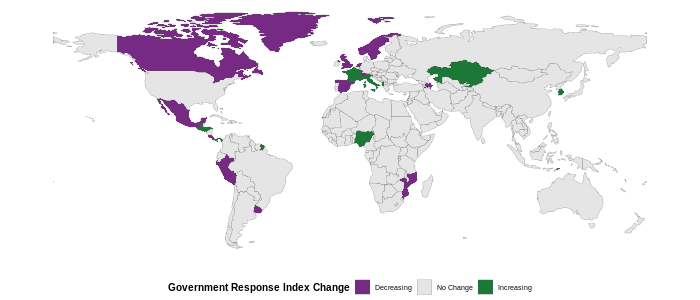

---  
layout: recent-changes  
title: Recent policy changes reported in the OxCGRT  
permalink: /recent-changes/  
---

This website contains recent policy changes reported in the global
[Oxford COVID-19 Government Response Tracker
(OxCGRT)](www.bsg.ox.ac.uk/covidtracker) database. It includes policies
which have come into force within the last two weeks. It is arranged by
country and then by indicator. For more details on the coding policy
please see our
[Codebook](https://github.com/OxCGRT/covid-policy-tracker/blob/master/documentation/codebook.md)
and [Interpretation
Guide](https://github.com/OxCGRT/covid-policy-tracker/blob/master/documentation/interpretation_guide.md).

Data in the OxCGRT database is recorded by volunteers from all over the
world on a weekly schedule. Our coverage may not yet be completely
up-to-date until the present day with recent policy changes. This site
is updated daily, so check back for the latest information.

## Global Changes in Government Response Index

The Government Response Index is an aggregate summary of all 20 of our
policy indicators. The index goes from 0 to 100, and a higher number
generally means a more active policy (eg. more stringent restrictions,
more generous economic support, or more pro-active public health
measures).
<!-- The following map shows countries that have changed their response at some point during the last two weeks, resulting in an increase or decrease in the overall Government Response Index. -->
The headings for each country report how the index has changed from two
weeks ago. For more detail on the Government Response Index please see
our most recent [working
paper](https://www.bsg.ox.ac.uk/research/publications/variation-government-responses-covid-19)
or explore our [dataset
publication](https://doi.org/10.1038/s41562-021-01079-8).

<!-- ## Changes in Policy over the last two weeks

<i>Last updated  2021-08-30</i>
<h4>Overall increase</h4>

<a href="#austria-gri-72--74">Austria (GRI: 72 ↑ 74)</a> 

<a href="#canada-gri-59--65">Canada (GRI: 59 ↑ 65)</a> 

<a href="#germany-gri-64--67">Germany (GRI: 64 ↑ 67)</a> 

<a href="#japan-gri-57--58">Japan (GRI: 57 ↑ 58)</a> 

<a href="#norway-gri-50--53">Norway (GRI: 50 ↑ 53)</a> 

  <h4>Overall decrease</h4>

<a href="#bahamas-gri-68--65">Bahamas (GRI: 68 ↓ 65)</a> 

<a href="#israel-gri-63--59">Israel (GRI: 63 ↓ 59)</a> 

<a href="#portugal-gri-67--64">Portugal (GRI: 67 ↓ 64)</a> 

  
-->

Please see our
[Codebook](https://github.com/OxCGRT/covid-policy-tracker/blob/master/documentation/codebook.md)
for a full description of the policies we track.

### Austria (GRI: 72 ↑ 74)

#### Restrictions on gatherings (C4)

<table class="table" style="margin-left: auto; margin-right: auto;">

<tbody>

<tr>

<td style="text-align:left;min-width: 2in; ">

<b>Old policy:</b>

Restrictions on <b>large</b> gatherings (between 101-1000 people); in
<b>some</b> parts of Austria (2T)

</td>

<td style="text-align:left;min-width: 1in; color: grey80 !important;">

25/8/2021  

</td>

<td style="text-align:left;min-width: 2in; ">

<b>New policy:</b>

Restrictions on <b>medium</b> gatherings (11-100 people); in <b>some</b>
parts of Austria (3T)

</td>

<td style="text-align:left;min-width: 4in; ">

"“Furthermore, from August 25, 2021 (until September 1, 2021) for the
municipality of Innervillgraten, meetings are only permitted with up to
50 people. In any case, a mask (FFP2) must be worn at permissible
gatherings, a 3G verification must be checked and a registration must be
carried out. Details can be found in the relevant ordinance.”" Source:
<https://archive.vn/VwD0y#selection-835.0-857.3>

</td>

</tr>

</tbody>

</table>

### Bahamas (GRI: 68 ↓ 65)

#### Protection of elderly people (H8)

<table class="table" style="margin-left: auto; margin-right: auto;">

<tbody>

<tr>

<td style="text-align:left;min-width: 2in; ">

<b>Old policy:</b>

<b>Extensive restrictions</b> for protection of elderly people; in
<b>some</b> parts of Bahamas (3T)

</td>

<td style="text-align:left;min-width: 1in; color: grey80 !important;">

18/8/2021  

</td>

<td style="text-align:left;min-width: 2in; ">

<b>New policy:</b>

<b>Recommended</b> isolation, hygiene, and visitor restriction measures
in LTCFs and/or elderly people to stay at home; across <b>all</b> of
Bahamas (1G)

</td>

<td style="text-align:left;min-width: 4in; ">

Recomend taking extra measures to put distance between yourself and
other people to further reduce your risk of being exposed to this new
virus: \* Stay home as much as possible. \* Consider ways of getting
food brought to your house through family, social, or commercial
networks Source:
<https://web.archive.org/web/20210122033858/https://covid19.gov.bs/if-you-are-high-risk/>

</td>

</tr>

</tbody>

</table>

### Botswana (GRI: 65 ↑ 66)

### Canada (GRI: 59 ↑ 65)

#### Workplace closing (C2)

<table class="table" style="margin-left: auto; margin-right: auto;">

<tbody>

<tr>

<td style="text-align:left;min-width: 2in; ">

<b>Old policy:</b>

<b>Require</b> closure of <b>some</b> sectors of business; in
<b>some</b> parts of Canada (2T)

</td>

<td style="text-align:left;min-width: 1in; color: grey80 !important;">

25/8/2021  

</td>

<td style="text-align:left;min-width: 2in; ">

<b>New policy:</b>

<b>Require</b> closure of <b>all</b> sectors of business; in <b>some</b>
parts of Canada (3T)

</td>

<td style="text-align:left;min-width: 4in; ">

On 25 august 2021, the government of Northwest Territories (NWT) orders
in the town of Norman Wells: “Non-essential businesses and facilities
must close to the public … Essential businesses and facilities may
remain open to the public with no more than ten (10) persons … Physical
distancing of at least 2 metres shall be maintained amongst persons from
different households”. In Manitoba, businesses are open with guidelines,
but access to casinos and bingo halls is restricted to fully vaccinated
patrons with “proof-of-immunization cards”. Some provinces – e.g.,
Alberta, Saskatchewan, New Brunswick – have revoked covid-related public
health requirements for business operations. See government of NWT
website, archived:
<https://web.archive.org/web/20210826105622/https://www.gov.nt.ca/covid-19/sites/covid/files/resources/2021-08-25_norman_wells_containment_order_0.pdf>

</td>

</tr>

</tbody>

</table>

#### Cancel public events (C3)

<table class="table" style="margin-left: auto; margin-right: auto;">

<tbody>

<tr>

<td style="text-align:left;min-width: 2in; ">

<b>Old policy:</b>

<b>Recommend</b> cancellation of public events; in <b>some</b> parts of
Canada (1T)

</td>

<td style="text-align:left;min-width: 1in; color: grey80 !important;">

26/8/2021  

</td>

<td style="text-align:left;min-width: 2in; ">

<b>New policy:</b>

<b>Require</b> cancellation of public events; in <b>some</b> parts of
Canada (2T)

</td>

<td style="text-align:left;min-width: 4in; ">

On 26 august 2021, in the Northwest Territories (NWT), the town of
Norman Wells makes clear that the gathering prohibition applies across
the board: “There are no gatherings allowed at this time either indoor
or outdoor.” In some provinces and territories, public events are
permitted with capacity limits, mask requirements and other guidelines.
Some provinces – e.g., Alberta, Saskatchewan, New Brunswick – have
revoked covid-related public health requirements for public events. In
the province of Manitoba, professional sporting events, horse and auto
racing, concert halls and outdoor performing arts events continue to be
limited to vaccinated individuals. See government of NWT website, Retail
Council of Canada and Province of Manitoba websites, archived:
<https://web.archive.org/web/20210826193139/www.retailcouncil.org/coronavirus-info-for-retailers/provincial-reopening-frameworks/>
<https://web.archive.org/web/20210812112606/https://news.gov.mb.ca/asset_library/en/newslinks/2021/08/BG-PHO_Update_Aug_7-PR-CPPHO.pdf>
<https://web.archive.org/web/20210826191535/normanwells.com/updates/community-update-august-26-2021/>

</td>

</tr>

</tbody>

</table>

### Colombia (GRI: 62 ↓ 60)

### Congo (GRI: 29 ↑ 37)

### Czech Republic (GRI: 52 ↓ 51)

### Ethiopia (GRI: 46 ↓ 44)

### Germany (GRI: 64 ↑ 67)

#### School closing (C1)

<table class="table" style="margin-left: auto; margin-right: auto;">

<tbody>

<tr>

<td style="text-align:left;min-width: 2in; ">

<b>Old policy:</b>

<b>Recommended closure</b> of schools or open with significant
operational differences; across <b>all</b> of Germany (1G)

</td>

<td style="text-align:left;min-width: 1in; color: grey80 !important;">

24/8/2021  

</td>

<td style="text-align:left;min-width: 2in; ">

<b>New policy:</b>

<b>Require</b> closure of <b>all</b> levels of schools; in <b>some</b>
parts of Germany (3T)

</td>

<td style="text-align:left;min-width: 4in; ">

According to the nationwide emergency brake, there can be no in-person
teaching if 7-day incidence \> 165. There are some states with 7-day
incidence \> 165. Source: <https://archive.fo/OCyn8>
<https://web.archive.org/web/20210823172205/https://www.bundesregierung.de/breg-en/news/nationwide-emergency-brake-1889136>

</td>

</tr>

</tbody>

</table>

#### Restrictions on gatherings (C4)

<table class="table" style="margin-left: auto; margin-right: auto;">

<tbody>

<tr>

<td style="text-align:left;min-width: 2in; ">

<b>Old policy:</b>

Restrictions on <b>small</b> gatherings (10 people or fewer); across
<b>all</b> of Germany (4G)

</td>

<td style="text-align:left;min-width: 1in; color: grey80 !important;">

20/8/2021  

</td>

<td style="text-align:left;min-width: 2in; ">

<b>New policy:</b>

Restrictions on <b>medium</b> gatherings (11-100 people); across
<b>all</b> of Germany (3G)

</td>

<td style="text-align:left;min-width: 4in; ">

In Berlin- Private meetings indoors are permitted without any limits on
the amount of people attending. Outside gatherings are allowed for a
maximum of 100 people. Your own children up to 14 years of age as well
as vaccinated and recovered persons are not included. The permitted
number of people at special celebrations is 50 persons indoors and 100
persons outdoors.
<https://web.archive.org/web/20210820042720/https://www.berlin.de/corona/en/measures/>

</td>

</tr>

</tbody>

</table>

#### Stay at home requirements (C6)

<table class="table" style="margin-left: auto; margin-right: auto;">

<tbody>

<tr>

<td style="text-align:left;min-width: 2in; ">

<b>Old policy:</b>

<b>Recommend</b> not leaving the house; across <b>all</b> of Germany
(1G)

</td>

<td style="text-align:left;min-width: 1in; color: grey80 !important;">

24/8/2021  

</td>

<td style="text-align:left;min-width: 2in; ">

<b>New policy:</b>

<b>Require</b> not leaving the house with exceptions for daily exercise,
grocery shopping, and ‘essential’ trips; in <b>some</b> parts of Germany
(2T)

</td>

<td style="text-align:left;min-width: 4in; ">

Curfews put in place if 7-day incidence \> 100: Between 22:00 (10pm) and
5:00 (5am) people will only be permitted to leave their homes if they
have a good reason, such as going to or from work, seeking medical
assistance or taking a dog for a walk. Until midnight it will be
permissible to go for a walk or a jog alone. Some states with 7-day
incidence \> 100, hence coded as 2T. Source:
<http://web.archive.org/web/20210424104907/https://www.bundesregierung.de/breg-en/news/nationwide-emergency-brake-1889136>
<https://archive.fo/OCyn8>

</td>

</tr>

</tbody>

</table>

### Iran (GRI: 67 ↓ 63)

### Israel (GRI: 63 ↓ 59)

#### School closing (C1)

<table class="table" style="margin-left: auto; margin-right: auto;">

<tbody>

<tr>

<td style="text-align:left;min-width: 2in; ">

<b>Old policy:</b>

<b>Recommended closure</b> of schools or open with significant
operational differences; across <b>all</b> of Israel (1G)

</td>

<td style="text-align:left;min-width: 1in; color: grey80 !important;">

18/8/2021  

</td>

<td style="text-align:left;min-width: 2in; ">

<b>New policy:</b>

<b>Require</b> closure of <b>some</b> levels of schools; across
<b>all</b> of Israel (2G)

</td>

<td style="text-align:left;min-width: 4in; ">

Regulations begin on 18 August restricting access to universities for
those with green passes. New regulations introduced for schools. Source:
<https://archive.vn/w6pFw>

</td>

</tr>

</tbody>

</table>

### Japan (GRI: 57 ↑ 58)

#### School closing (C1)

<table class="table" style="margin-left: auto; margin-right: auto;">

<tbody>

<tr>

<td style="text-align:left;min-width: 2in; ">

<b>Old policy:</b>

<b>Recommended closure</b> of schools or open with significant
operational differences; across <b>all</b> of Japan (1G)

</td>

<td style="text-align:left;min-width: 1in; color: grey80 !important;">

21/8/2021  

</td>

<td style="text-align:left;min-width: 2in; ">

<b>New policy:</b>

<b>Require</b> closure of <b>some</b> levels of schools; in <b>some</b>
parts of Japan (2T)

</td>

<td style="text-align:left;min-width: 4in; ">

Yokohama City has announced it will temporarily close elementary and
junior high schools to delay reopening after summer vacation past August
29. A further announcement will be made beginning next week with details
on the closure. In Kanagawa Prefecture, Sagamihara City and Kawasaki
City have also decided to temporarily close municipal elementary and
junior high schools throughout the month of August.
<https://web.archive.org/web/20210822072727/https://www3.nhk.or.jp/news/html/20210821/k10013215561000.html>

</td>

</tr>

</tbody>

</table>

### Kazakhstan (GRI: 45 ↑ 50)

### Lithuania (GRI: 55 ↑ 55)

### Mongolia (GRI: 54 ↑ 60)

### New Zealand (GRI: 88 ↑ 90)

### Norway (GRI: 50 ↑ 53)

#### Testing policy (H2)

<table class="table" style="margin-left: auto; margin-right: auto;">

<tbody>

<tr>

<td style="text-align:left;min-width: 2in; ">

<b>Old policy:</b>

Anyone <b>symptomatic</b> can be tested; NA Norway (2)

</td>

<td style="text-align:left;min-width: 1in; color: grey80 !important;">

21/8/2021  

</td>

<td style="text-align:left;min-width: 2in; ">

<b>New policy:</b>

<b>Anyone</b> can be tested (open testing) is present; NA Norway (3)

</td>

<td style="text-align:left;min-width: 4in; ">

No policy change. The Norwegian Institute of Public Health (NIPH / FHI)
recommends that anyone who suspects they might be infected by the
coronavirus is given the opportunity to be tested.
<https://web.archive.org/web/20210817075815/https://www.helsenorge.no/en/coronavirus/testing-symptoms-and-close-contacts/#testing>
<https://web.archive.org/web/20210828083843/https://www.regjeringen.no/en/topics/koronavirus-covid-19/national-measures-from-16-april-2021/id2826828/>

</td>

</tr>

</tbody>

</table>

#### Facial Coverings (H6)

<table class="table" style="margin-left: auto; margin-right: auto;">

<tbody>

<tr>

<td style="text-align:left;min-width: 2in; ">

<b>Old policy:</b>

<b>Required</b> wearing of face masks in <b>specific shared spaces</b>
outside the home when other people are present; in <b>some</b> parts of
Norway (2T)

</td>

<td style="text-align:left;min-width: 1in; color: grey80 !important;">

21/8/2021  

</td>

<td style="text-align:left;min-width: 2in; ">

<b>New policy:</b>

<b>Required</b> wearing of face masks in <b>specific shared spaces</b>
outside the home when other people are present; across <b>all</b> of
Norway (2G)

</td>

<td style="text-align:left;min-width: 4in; ">

No policy change. Continued from 13 Aug, the recommendation is not to
exceed a maximum of 20 guests, and people are encouraged to meet
outdoors. Travel is not recommended unless necessary. Face coverings are
recommended on public transit. Wearing a face covering is mandatory when
recommended social distancing cannot be maintained. If taking a taxi,
passengers are advised to wear a mask and avoid sitting in the front
passenger seat.
<https://web.archive.org/web/20210828083843/https://www.regjeringen.no/en/topics/koronavirus-covid-19/national-measures-from-16-april-2021/id2826828/>
<https://web.archive.org/web/20210828083837/https://no.usembassy.gov/covid-19-information/>

</td>

</tr>

</tbody>

</table>

### Paraguay (GRI: 54 ↓ 51)

### Portugal (GRI: 67 ↓ 64)

#### Close public transport (C5)

<table class="table" style="margin-left: auto; margin-right: auto;">

<tbody>

<tr>

<td style="text-align:left;min-width: 2in; ">

<b>Old policy:</b>

<b>Recommended closure</b> (or significant reduction in volume/routes)
of public transport; across <b>all</b> of Portugal (1G)

</td>

<td style="text-align:left;min-width: 1in; color: grey80 !important;">

23/8/2021  

</td>

<td style="text-align:left;min-width: 2in; ">

<b>New policy:</b>

<b>No measures</b> are present across all of Portugal (0)

</td>

<td style="text-align:left;min-width: 4in; ">

Starting on August 23rd, public transport is no longer limited in its
capacity and is now allowed to use the front seats in taxi transport and
in the individual and paid transport of passengers in uncharacterised
vehicles from an electronic platform. Sources:
<https://archive.ph/8lEK5>

</td>

</tr>

</tbody>

</table>

### Russia (GRI: 59 ↓ 58)

### Saudi Arabia (GRI: 56 ↓ 54)

### South Africa (GRI: 62 ↑ 63)

### Sri Lanka (GRI: 77 ↑ 82)

### Taiwan (GRI: 56 ↑ 60)

### Trinidad and Tobago (GRI: 72 ↓ 70)

### United Arab Emirates (GRI: 69 ↓ 62)

### Vietnam (GRI: 67 ↑ 72)

   

This website and all OxCGRT data is published under a [Creative Commons
CC BY 4.0 license](https://creativecommons.org/licenses/by/4.0/),
meaning you are free to use it for any purpose, provided you attribute
us as the source. You can read more about citing our work on our [GitHub
repository](https://github.com/OxCGRT/covid-policy-tracker/blob/master/README.md#citing-our-data).

<i> This summary page was created by Andrew Wood and Toby Phillips. </i>

