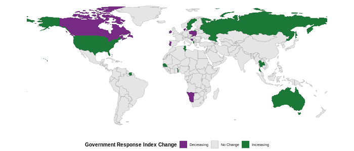

---  
layout: recent-changes  
title: Recent policy changes reported in the OxCGRT  
permalink: /recent-changes/  
---

This website contains recent policy changes reported in the global
[Oxford COVID-19 Government Response Tracker
(OxCGRT)](www.bsg.ox.ac.uk/covidtracker) database. It includes policies
which have come into force within the last two weeks. It is arranged by
country and then by indicator. For more details on the coding policy
please see our
[Codebook](https://github.com/OxCGRT/covid-policy-tracker/blob/master/documentation/codebook.md)
and [Interpretation
Guide](https://github.com/OxCGRT/covid-policy-tracker/blob/master/documentation/interpretation_guide.md).

Data in the OxCGRT database is recorded by volunteers from all over the
world on a weekly schedule. Our coverage may not yet be completely
up-to-date until the present day with recent policy changes. This site
is updated daily, so check back for the latest information.

## Global Changes in Government Response Index

The Government Response Index is an aggregate summary of all 20 of our
policy indicators. The index goes from 0 to 100, and a higher number
generally means a more active policy (eg. more stringent restrictions,
more generous economic support, or more pro-active public health
measures).
<!-- The following map shows countries that have changed their response at some point during the last two weeks, resulting in an increase or decrease in the overall Government Response Index. -->
The headings for each country report how the index has changed from two
weeks ago. For more detail on the Government Response Index please see
our most recent [working
paper](https://www.bsg.ox.ac.uk/research/publications/variation-government-responses-covid-19)
or explore our [dataset
publication](https://doi.org/10.1038/s41562-021-01079-8).

## Changes in Policy over the last two weeks

<i>Last updated 2021-10-27</i>

<h4>

Overall increase

</h4>

<a href="#andorra-gri-56--58">Andorra (GRI: 56 ↑ 58)</a>

<a href="#angola-gri-55--57">Angola (GRI: 55 ↑ 57)</a>

<a href="#austria-gri-70--74">Austria (GRI: 70 ↑ 74)</a>

<a href="#belgium-gri-57--59">Belgium (GRI: 57 ↑ 59)</a>

<a href="#burundi-gri-17--18">Burundi (GRI: 17 ↑ 18)</a>

<a href="#chile-gri-37--40">Chile (GRI: 37 ↑ 40)</a>

<a href="#eswatini-gri-59--64">Eswatini (GRI: 59 ↑ 64)</a>

<a href="#guinea-gri-53--63">Guinea (GRI: 53 ↑ 63)</a>

<a href="#kuwait-gri-51--58">Kuwait (GRI: 51 ↑ 58)</a>

<a href="#latvia-gri-45--58">Latvia (GRI: 45 ↑ 58)</a>

<a href="#liberia-gri-45--47">Liberia (GRI: 45 ↑ 47)</a>

<a href="#monaco-gri-49--50">Monaco (GRI: 49 ↑ 50)</a>

<a href="#nepal-gri-49--55">Nepal (GRI: 49 ↑ 55)</a>

<a href="#paraguay-gri-43--45">Paraguay (GRI: 43 ↑ 45)</a>

<a href="#syria-gri-40--45">Syria (GRI: 40 ↑ 45)</a>

<a href="#venezuela-gri-75--78">Venezuela (GRI: 75 ↑ 78)</a>

<a href="#vietnam-gri-57--61">Vietnam (GRI: 57 ↑ 61)</a>

 

<h4>

Overall decrease

</h4>

<a href="#afghanistan-gri-28--23">Afghanistan (GRI: 28 ↓ 23)</a>

<a href="#australia-gri-68--53">Australia (GRI: 68 ↓ 53)</a>

<a href="#bangladesh-gri-58--56">Bangladesh (GRI: 58 ↓ 56)</a>

<a href="#cambodia-gri-61--57">Cambodia (GRI: 61 ↓ 57)</a>

<a href="#canada-gri-66--64">Canada (GRI: 66 ↓ 64)</a>

<a href="#gambia-gri-37--33">Gambia (GRI: 37 ↓ 33)</a>

<a href="#greece-gri-76--72">Greece (GRI: 76 ↓ 72)</a>

<a href="#india-gri-59--57">India (GRI: 59 ↓ 57)</a>

<a href="#iran-gri-68--63">Iran (GRI: 68 ↓ 63)</a>

<a href="#ireland-gri-65--64">Ireland (GRI: 65 ↓ 64)</a>

<a href="#italy-gri-76--75">Italy (GRI: 76 ↓ 75)</a>

<a href="#kenya-gri-54--53">Kenya (GRI: 54 ↓ 53)</a>

<a href="#kiribati-gri-33--24">Kiribati (GRI: 33 ↓ 24)</a>

<a href="#madagascar-gri-48--34">Madagascar (GRI: 48 ↓ 34)</a>

<a href="#mauritius-gri-60--56">Mauritius (GRI: 60 ↓ 56)</a>

<a href="#nicaragua-gri-19--16">Nicaragua (GRI: 19 ↓ 16)</a>

<a href="#pakistan-gri-51--42">Pakistan (GRI: 51 ↓ 42)</a>

<a href="#saudi arabia-gri-57--55">Saudi Arabia (GRI: 57 ↓ 55)</a>

<a href="#slovak republic-gri-56--53">Slovak Republic (GRI: 56 ↓ 53)</a>

<a href="#united states virgin islands-gri-62--60">United States Virgin
Islands (GRI: 62 ↓ 60)</a>

 

Please see our
[Codebook](https://github.com/OxCGRT/covid-policy-tracker/blob/master/documentation/codebook.md)
for a full description of the policies we track.

### Afghanistan (GRI: 28 ↓ 23)

#### Workplace closing (C2)

<table class="table" style="margin-left: auto; margin-right: auto;">

<tbody>

<tr>

<td style="text-align:left;min-width: 2in; ">

<b>Old policy:</b>

<b>Require</b> closure of <b>some</b> sectors of business; across
<b>all</b> of Afghanistan (2G)

</td>

<td style="text-align:left;min-width: 1in; color: grey80 !important;">

18/10/2021  

</td>

<td style="text-align:left;min-width: 2in; ">

<b>New policy:</b>

<b>Require</b> closure of <b>some</b> sectors of business; in
<b>some</b> parts of Afghanistan (2T)

</td>

<td style="text-align:left;min-width: 4in; ">

18th October 2021: According to garda world, Localized business and
gathering controls are possible in areas with higher COVID-19 activity.
Enforcement and compliance with the directives have been generally poor,
particularly after the Taliban took over power in the country in
mid-August. Officials may impose heightened security measures in
localities with increased COVID-19 activity.See link below:
<https://web.archive.org/web/20211023193153/https://www.garda.com/crisis24/news-alerts/535386/afghanistan-covid-19-related-measures-remain-in-effect-nationwide-as-of-oct-18-update-20>

</td>

</tr>

</tbody>

</table>

#### Cancel public events (C3)

<table class="table" style="margin-left: auto; margin-right: auto;">

<tbody>

<tr>

<td style="text-align:left;min-width: 2in; ">

<b>Old policy:</b>

<b>Require</b> cancellation of public events; across <b>all</b> of
Afghanistan (2G)

</td>

<td style="text-align:left;min-width: 1in; color: grey80 !important;">

18/10/2021  

</td>

<td style="text-align:left;min-width: 2in; ">

<b>New policy:</b>

<b>No measures</b> are present across all of Afghanistan (0)

</td>

<td style="text-align:left;min-width: 4in; ">

no data available

</td>

</tr>

</tbody>

</table>

#### Close public transport (C5)

<table class="table" style="margin-left: auto; margin-right: auto;">

<tbody>

<tr>

<td style="text-align:left;min-width: 2in; ">

<b>Old policy:</b>

<b>Recommended closure</b> (or significant reduction in volume/routes)
of public transport; across <b>all</b> of Afghanistan (1G)

</td>

<td style="text-align:left;min-width: 1in; color: grey80 !important;">

18/10/2021  

</td>

<td style="text-align:left;min-width: 2in; ">

<b>New policy:</b>

<b>Require closure</b> (or significant reduction in volume/routes) of
public transport; in <b>some</b> parts of Afghanistan (2T)

</td>

<td style="text-align:left;min-width: 4in; ">

18th October 2021: according to Garda World COVID-19-related
restrictions remain in effect nationwide. Some transport disruptions are
possible due to the protocols. Officials may impose heightened security
measures in localities with increased COVID-19 activity.
<https://web.archive.org/web/20211023193153/https://www.garda.com/crisis24/news-alerts/535386/afghanistan-covid-19-related-measures-remain-in-effect-nationwide-as-of-oct-18-update-20>

</td>

</tr>

</tbody>

</table>

#### International travel controls (C8)

<table class="table" style="margin-left: auto; margin-right: auto;">

<tbody>

<tr>

<td style="text-align:left;min-width: 2in; ">

<b>Old policy:</b>

<b>Border closure</b> (ban on all regions) in Afghanistan (4)

</td>

<td style="text-align:left;min-width: 1in; color: grey80 !important;">

18/10/2021  

</td>

<td style="text-align:left;min-width: 2in; ">

<b>New policy:</b>

<b>Quarantine</b> arrivals from <b>some</b> regions coming into
Afghanistan (2)

</td>

<td style="text-align:left;min-width: 4in; ">

18th October 2021: according to Garda World Civilian authorities advise
individuals arriving in Afghanistan with no symptoms to self-quarantine
for 14 days and those displaying symptoms to contact the Ministry of
Public Health; it is unclear if the policy remains in place under the
Taliban.
<https://web.archive.org/web/20211023193153/https://www.garda.com/crisis24/news-alerts/535386/afghanistan-covid-19-related-measures-remain-in-effect-nationwide-as-of-oct-18-update-20>

</td>

</tr>

</tbody>

</table>

#### Public information campaigns (H1)

<table class="table" style="margin-left: auto; margin-right: auto;">

<tbody>

<tr>

<td style="text-align:left;min-width: 2in; ">

<b>Old policy:</b>

There is <b>no official</b> public information campaign across all of
Afghanistan (0)

</td>

<td style="text-align:left;min-width: 1in; color: grey80 !important;">

18/10/2021  

</td>

<td style="text-align:left;min-width: 2in; ">

<b>New policy:</b>

Public officials have a <b>co-ordinated public information campaign</b>
about COVID-19; across <b>all</b> of Afghanistan (2G)

</td>

<td style="text-align:left;min-width: 4in; ">

according to MoD Afghanistan COMMUNICATION MATERIALS TO PREVENT THE
SPREAD OF THE NEW CORONA VIRUS • Posters • Flyers • Photos for Facebook
• Brochures • Billboards • Signboards
<https://web.archive.org/web/20211023202548/https://moph.gov.af/ps/node/1412>

</td>

</tr>

</tbody>

</table>

#### Testing policy (H2)

<table class="table" style="margin-left: auto; margin-right: auto;">

<tbody>

<tr>

<td style="text-align:left;min-width: 2in; ">

<b>Old policy:</b>

NA; NA Afghanistan (1)

</td>

<td style="text-align:left;min-width: 1in; color: grey80 !important;">

18/10/2021  

</td>

<td style="text-align:left;min-width: 2in; ">

<b>New policy:</b>

<b>No testing policy</b> are present across all of Afghanistan (0)

</td>

<td style="text-align:left;min-width: 4in; ">

no evidence of this found

</td>

</tr>

</tbody>

</table>

### Andorra (GRI: 56 ↑ 58)

#### Income support (E1)

<table class="table" style="margin-left: auto; margin-right: auto;">

<tbody>

<tr>

<td style="text-align:left;min-width: 2in; ">

<b>Old policy:</b>

Government is replacing <b>more than 50% income</b>; for <b>formal
workers only</b> in Andorra (2F)

</td>

<td style="text-align:left;min-width: 1in; color: grey80 !important;">

19/10/2021  

</td>

<td style="text-align:left;min-width: 2in; ">

<b>New policy:</b>

Government is replacing <b>more than 50% income</b>; for <b>all
workers</b> in Andorra (2A)

</td>

<td style="text-align:left;min-width: 4in; ">

No changes found.

</td>

</tr>

</tbody>

</table>

### Angola (GRI: 55 ↑ 57)

#### Testing policy (H2)

<table class="table" style="margin-left: auto; margin-right: auto;">

<tbody>

<tr>

<td style="text-align:left;min-width: 2in; ">

<b>Old policy:</b>

Anyone <b>symptomatic</b> can be tested; NA Angola (2)

</td>

<td style="text-align:left;min-width: 1in; color: grey80 !important;">

17/10/2021  

</td>

<td style="text-align:left;min-width: 2in; ">

<b>New policy:</b>

<b>Anyone</b> can be tested (open testing) is present; NA Angola (3)

</td>

<td style="text-align:left;min-width: 4in; ">

As of January 16, 2021, upon arrival at the Aeroporto Internacional
Quatro de Fevereiro in Luanda, all arriving passengers on international
flights, regardless of citizenship, may be required to take a COVID test
at the airport before being allowed to enter the country. As of October
15, proof of vaccination (at least one dose) or a negative COVID test is
required of anyone over the age of 18 in some situations.
<https://web.archive.org/web/20211012232423/https://ao.usembassy.gov/covid-19-information/>

</td>

</tr>

</tbody>

</table>

### Australia (GRI: 68 ↓ 53)

#### Workplace closing (C2)

<table class="table" style="margin-left: auto; margin-right: auto;">

<tbody>

<tr>

<td style="text-align:left;min-width: 2in; ">

<b>Old policy:</b>

<b>Require</b> closure of <b>all</b> sectors of business; in <b>some</b>
parts of Australia (3T)

</td>

<td style="text-align:left;min-width: 1in; color: grey80 !important;">

22/10/2021  

</td>

<td style="text-align:left;min-width: 2in; ">

<b>New policy:</b>

<b>No measures</b> are present across all of Australia (0)

</td>

<td style="text-align:left;min-width: 4in; ">

Starting 22 Oct curfews and lockdowns have ended. Restrictions vary by
region but generally are eased for people who are fully vaccinated or
have a medical exemption. Workplaces have opened with hygiene or
capacity restrictions. Example: up to 75 per cent or up to 30 people can
return if total workplace is 40 or less, if there’s no more than 1
person per 4 square metres for Metropolitan Melbourne locations, and no
more than 1 person per 2 square metres for Regional Victoria locations.
<https://web.archive.org/web/20210708181532/https://www.healthdirect.gov.au/covid19-restriction-checker/gatherings-and-work/vic>
<https://web.archive.org/web/20211022184508/https://www.theguardian.com/australia-news/2021/oct/22/melbourne-covid-lockdown-ends-lifts-today-friday-victoria-end-lift-change-what-are-the-new-restrictions-rules-freedoms-reopening-plan>
<https://web.archive.org/web/20211022043759/https://www.nsw.gov.au/covid-19/easing-covid-19-restrictions/80-percent>

</td>

</tr>

</tbody>

</table>

#### Cancel public events (C3)

<table class="table" style="margin-left: auto; margin-right: auto;">

<tbody>

<tr>

<td style="text-align:left;min-width: 2in; ">

<b>Old policy:</b>

<b>Require</b> cancellation of public events; in <b>some</b> parts of
Australia (2T)

</td>

<td style="text-align:left;min-width: 1in; color: grey80 !important;">

22/10/2021  

</td>

<td style="text-align:left;min-width: 2in; ">

<b>New policy:</b>

<b>No measures</b> are present across all of Australia (0)

</td>

<td style="text-align:left;min-width: 4in; ">

Starting 22 Oct curfews and lockdowns have ended. Restrictions vary by
region but generally are eased for people who are fully vaccinated or
have a medical exemption. Generally indoor events have a capacity
restriction of 75 per cent but outdoor events have 100 per cent capacity
with social distancing. Example: A maximum of 2,000 people can attend a
controlled, ticketed outdoor event if they’re assigned a specific seat —
subject to 1 person per 2 square metres. A maximum of 500 people can
attend a controlled, ticketed outdoor event if they’re allocated to a
designated seating area — subject to 1 person per 2 square metres.
Indoor entertainment facilities can sell tickets for seated events at 75
per cent of fixed seating capacity or no more than 1 person per 2 square
metres on the premises. Outdoor entertainment facilities can sell
tickets for seated events at 100 per cent of fixed seating capacity or
no more than 1 person per 2 square metres on the premises.
<https://web.archive.org/web/20210307062444/https://www.healthdirect.gov.au/covid19-restriction-checker/entertainment-and-amusement-venues/nsw>
<https://web.archive.org/web/20210708181532/https://www.healthdirect.gov.au/covid19-restriction-checker/gatherings-and-work/vic>
<https://web.archive.org/web/20211022184508/https://www.theguardian.com/australia-news/2021/oct/22/melbourne-covid-lockdown-ends-lifts-today-friday-victoria-end-lift-change-what-are-the-new-restrictions-rules-freedoms-reopening-plan>
<https://web.archive.org/web/20211022043759/https://www.nsw.gov.au/covid-19/easing-covid-19-restrictions/80-percent>

</td>

</tr>

</tbody>

</table>

#### Stay at home requirements (C6)

<table class="table" style="margin-left: auto; margin-right: auto;">

<tbody>

<tr>

<td style="text-align:left;min-width: 2in; ">

<b>Old policy:</b>

<b>Require</b> not leaving the house with exceptions for daily exercise,
grocery shopping, and ‘essential’ trips; in <b>some</b> parts of
Australia (2T)

</td>

<td style="text-align:left;min-width: 1in; color: grey80 !important;">

22/10/2021  

</td>

<td style="text-align:left;min-width: 2in; ">

<b>New policy:</b>

<b>No measures</b> are present across all of Australia (0)

</td>

<td style="text-align:left;min-width: 4in; ">

Starting 22 Oct curfews and lockdowns have ended. Restrictions vary by
region but generally are eased for people who are fully vaccinated or
have a medical exemption.
<https://web.archive.org/web/20210307062444/https://www.healthdirect.gov.au/covid19-restriction-checker/entertainment-and-amusement-venues/nsw>
<https://web.archive.org/web/20210831161454/https://www.healthdirect.gov.au/covid19-restriction-checker/hotspots-and-case-locations/vic>
<https://web.archive.org/web/20211022184508/https://www.theguardian.com/australia-news/2021/oct/22/melbourne-covid-lockdown-ends-lifts-today-friday-victoria-end-lift-change-what-are-the-new-restrictions-rules-freedoms-reopening-plan>
<https://web.archive.org/web/20211022043759/https://www.nsw.gov.au/covid-19/easing-covid-19-restrictions/80-percent>

</td>

</tr>

</tbody>

</table>

#### Facial Coverings (H6)

<table class="table" style="margin-left: auto; margin-right: auto;">

<tbody>

<tr>

<td style="text-align:left;min-width: 2in; ">

<b>Old policy:</b>

<b>Required</b> wearing of face masks in <b>all shared spaces</b>
outside the home when other people are present <b>or</b> when social
distancing not possible; in <b>some</b> parts of Australia (3T)

</td>

<td style="text-align:left;min-width: 1in; color: grey80 !important;">

22/10/2021  

</td>

<td style="text-align:left;min-width: 2in; ">

<b>New policy:</b>

<b>Required</b> wearing of face masks at <b>all times</b> outside the
home; in <b>some</b> parts of Australia (4T)

</td>

<td style="text-align:left;min-width: 4in; ">

Starting 22 Oct curfews and lockdowns have ended. Restrictions vary by
region but generally masks are required in certain public spaces. In
Victoria you must wear a face mask whenever you leave your home in both
indoor and outdoor settings. You must carry a mask at all times.
<https://web.archive.org/web/20211022194019/https://www.healthdirect.gov.au/covid19-restriction-checker/face-masks/vic>
<https://web.archive.org/web/20211004184048/https://www.health.gov.au/news/health-alerts/novel-coronavirus-2019-ncov-health-alert/coronavirus-covid-19-case-numbers-and-statistics>

</td>

</tr>

</tbody>

</table>

#### Protection of elderly people (H8)

<table class="table" style="margin-left: auto; margin-right: auto;">

<tbody>

<tr>

<td style="text-align:left;min-width: 2in; ">

<b>Old policy:</b>

<b>Extensive restrictions</b> for protection of elderly people; in
<b>some</b> parts of Australia (3T)

</td>

<td style="text-align:left;min-width: 1in; color: grey80 !important;">

22/10/2021  

</td>

<td style="text-align:left;min-width: 2in; ">

<b>New policy:</b>

<b>Recommended</b> isolation, hygiene, and visitor restriction measures
in LTCFs and/or elderly people to stay at home; across <b>all</b> of
Australia (1G)

</td>

<td style="text-align:left;min-width: 4in; ">

Starting 22 Oct curfews and lockdowns have ended. National policy
outlines recommended guidelines to protect the elderly along a three
tiered system. The visitation restrictions and guidelines for
residential aged care facilities follow social distancing, vaccination
and COVID screening norms.
<https://web.archive.org/web/20210415104420/https://www.health.gov.au/sites/default/files/documents/2020/11/coronavirus-covid-19-national-aged-care-guidance-escalation-tiers-and-aged-care-provider-responses.pdf>
<https://web.archive.org/web/20211021011733/https://www.health.gov.au/node/18602/coronavirus-covid-19-advice-for-people-in-residential-aged-care-facilities-and-visitors>

</td>

</tr>

</tbody>

</table>

### Austria (GRI: 70 ↑ 74)

#### Restrictions on internal movement (C7)

<table class="table" style="margin-left: auto; margin-right: auto;">

<tbody>

<tr>

<td style="text-align:left;min-width: 2in; ">

<b>Old policy:</b>

<b>No measures</b> are present across all of Austria (0)

</td>

<td style="text-align:left;min-width: 1in; color: grey80 !important;">

18/10/2021  

</td>

<td style="text-align:left;min-width: 2in; ">

<b>New policy:</b>

<b>Internal travel restrictions</b> are in place; in <b>some</b> parts
of Austria (2T)

</td>

<td style="text-align:left;min-width: 4in; ">

Measures for the municipality of St. Koloman "“From October 18, 2021
(until October 31, 2021), the following applies to the municipality of
St. Koloman: Leaving the municipality - with a few exceptions - is only
possible with a 2G test (vaccination or recovery) or by means of a
negative PCR test (not older than 72 hours), permitted (see
corresponding ordinance).”" Source: <https://archive.vn/tYjaF> \[Special
regulations for Salzburg\]

</td>

</tr>

</tbody>

</table>

### Bangladesh (GRI: 58 ↓ 56)

#### International travel controls (C8)

<table class="table" style="margin-left: auto; margin-right: auto;">

<tbody>

<tr>

<td style="text-align:left;min-width: 2in; ">

<b>Old policy:</b>

<b>Ban</b> arrivals from <b>some</b> regions coming into Bangladesh (3)

</td>

<td style="text-align:left;min-width: 1in; color: grey80 !important;">

19/10/2021  

</td>

<td style="text-align:left;min-width: 2in; ">

<b>New policy:</b>

<b>Quarantine</b> arrivals from <b>some</b> regions coming into
Bangladesh (2)

</td>

<td style="text-align:left;min-width: 4in; ">

Officials have eased COVID-19-related quarantine requirements for
vaccinated international arrivals from most locations as of Oct. 25.
Vaccinated arrivals from Armenia, Bulgaria, Estonia, Georgia, Latvia,
Lithuania, Moldova, Mongolia, Palestine, Romania, Serbia, Slovenia, and
Ukraine must quarantine at their residence for seven days, while
unvaccinated entrants from these locations must quarantine at a
designated facility for seven days at their own expense. Vaccinated
arrivals from all other locations no longer have to quarantine, while
unvaccinated entrants must quarantine at their residence for 14 days.
Symptomatic arrivals from any location or with any vaccination status
must isolate at a designated facility.
<https://web.archive.org/web/20211025133025/https://www.garda.com/crisis24/news-alerts/538041/bangladesh-authorities-lift-quarantine-requirements-for-vaccinated-international-arrivals-from-most-locations-as-of-oct-25-update-60>

</td>

</tr>

</tbody>

</table>

### Belgium (GRI: 57 ↑ 59)

#### Cancel public events (C3)

<table class="table" style="margin-left: auto; margin-right: auto;">

<tbody>

<tr>

<td style="text-align:left;min-width: 2in; ">

<b>Old policy:</b>

<b>Recommend</b> cancellation of public events; across <b>all</b> of
Belgium (1G)

</td>

<td style="text-align:left;min-width: 1in; color: grey80 !important;">

15/10/2021  

</td>

<td style="text-align:left;min-width: 2in; ">

<b>New policy:</b>

<b>Require</b> cancellation of public events; in <b>some</b> parts of
Belgium (2T)

</td>

<td style="text-align:left;min-width: 4in; ">

Brussels introduced a COVID-19 certificate scheme; only allowing those
that are vaccinated to enter public events.
<https://web.archive.org/web/20211019035155/https://www.aa.com.tr/en/europe/brussels-makes-covid-19-pass-obligatory-in-restaurants-gyms/2393111>

</td>

</tr>

</tbody>

</table>

### Burundi (GRI: 17 ↑ 18)

#### Vaccination policy (H7)

<table class="table" style="margin-left: auto; margin-right: auto;">

<tbody>

<tr>

<td style="text-align:left;min-width: 2in; ">

<b>Old policy:</b>

<b>No availability</b> is present across all of Burundi (0)

</td>

<td style="text-align:left;min-width: 1in; color: grey80 !important;">

18/10/2021  

</td>

<td style="text-align:left;min-width: 2in; ">

<b>New policy:</b>

Available to <b>ONE</b> key group (key workers, elderly, clinically
vulnerable); at no / minimal cost to the individual (government funded
or subsidised) Burundi (1S)

</td>

<td style="text-align:left;min-width: 4in; ">

The vaccination drive just began in Burundi, and it is unclear which
groups are eligible.
<https://web.archive.org/web/20211020114230/https://www.reuters.com/world/africa/burundi-launches-covid-19-vaccination-drive-2021-10-18/>

</td>

</tr>

</tbody>

</table>

### Cambodia (GRI: 61 ↓ 57)

#### Workplace closing (C2)

<table class="table" style="margin-left: auto; margin-right: auto;">

<tbody>

<tr>

<td style="text-align:left;min-width: 2in; ">

<b>Old policy:</b>

<b>Require</b> closure of <b>all</b> sectors of business; in <b>some</b>
parts of Cambodia (3T)

</td>

<td style="text-align:left;min-width: 1in; color: grey80 !important;">

19/10/2021  

</td>

<td style="text-align:left;min-width: 2in; ">

<b>New policy:</b>

<b>Require</b> closure of <b>some</b> sectors of business; in
<b>some</b> parts of Cambodia (2T)

</td>

<td style="text-align:left;min-width: 4in; ">

"“Certain businesses deemed at a high risk of transmitting the virus
such as entertainment complexes have been ordered closed in some
provinces. (effective from 18th October)”" - especially in some "“red
zone”" areas. For example, in Phnom Penh (15-Oct-2021 to 28-Oct-2021),
"“1. Suspend all businesses that are high risk of Covid: - All kinds
of entertainment club businesses ex karaoke, discotheque, cinemas and
bars; 2. Businesses not suspended must strictly adhere to safety
measures (3 do’s/3 don’ts) and sanitization”" link:
<https://archive.ph/Q207o> link: <https://archive.ph/af8bR> link:
<https://archive.ph/hf2cm>

</td>

</tr>

</tbody>

</table>

#### Cancel public events (C3)

<table class="table" style="margin-left: auto; margin-right: auto;">

<tbody>

<tr>

<td style="text-align:left;min-width: 2in; ">

<b>Old policy:</b>

<b>Require</b> cancellation of public events; across <b>all</b> of
Cambodia (2G)

</td>

<td style="text-align:left;min-width: 1in; color: grey80 !important;">

19/10/2021  

</td>

<td style="text-align:left;min-width: 2in; ">

<b>New policy:</b>

<b>Require</b> cancellation of public events; in <b>some</b> parts of
Cambodia (2T)

</td>

<td style="text-align:left;min-width: 4in; ">

"“The public is directed to?avoid?close contact with
others,?remaining?in closed air-conditioned?rooms, and?gatherings?of
more than 50 people to minimize community transmission”" (effective from
18 October). This is a general recommendation. But according to some
local Administrative Measures, for example, in Mondulkiri Province,
"“effective 14-June-2021 Admin Measures - No Expiry Ban on Sports/Gyms
+ Ban on Gatherings of more than 5 people + Ban on Dine-In”". This is a
stricter target requirement. link: <https://archive.ph/af8bR> link:
<https://archive.ph/hf2cm>

</td>

</tr>

</tbody>

</table>

#### Restrictions on gatherings (C4)

<table class="table" style="margin-left: auto; margin-right: auto;">

<tbody>

<tr>

<td style="text-align:left;min-width: 2in; ">

<b>Old policy:</b>

Restrictions on <b>small</b> gatherings (10 people or fewer); across
<b>all</b> of Cambodia (4G)

</td>

<td style="text-align:left;min-width: 1in; color: grey80 !important;">

19/10/2021  

</td>

<td style="text-align:left;min-width: 2in; ">

<b>New policy:</b>

Restrictions on <b>small</b> gatherings (10 people or fewer); in
<b>some</b> parts of Cambodia (4T)

</td>

<td style="text-align:left;min-width: 4in; ">

"“The public is directed to?avoid?close contact with
others,?remaining?in closed air-conditioned?rooms, and?gatherings?of
more than 50 people to minimize community transmission”" (effective from
18 October). This is a general recommendation. But according to some
local Administrative Measures, for example, in Mondulkiri Province,
"“effective 14-June-2021 Admin Measures - No Expiry Ban on Sports/Gyms
+ Ban on Gatherings of more than 5 people + Ban on Dine-In”". This is a
stricter target requirement. link: <https://archive.ph/af8bR> link:
<https://archive.ph/hf2cm>

</td>

</tr>

</tbody>

</table>

### Canada (GRI: 66 ↓ 64)

#### Protection of elderly people (H8)

<table class="table" style="margin-left: auto; margin-right: auto;">

<tbody>

<tr>

<td style="text-align:left;min-width: 2in; ">

<b>Old policy:</b>

<b>Extensive restrictions</b> for protection of elderly people; in
<b>some</b> parts of Canada (3T)

</td>

<td style="text-align:left;min-width: 1in; color: grey80 !important;">

22/10/2021  

</td>

<td style="text-align:left;min-width: 2in; ">

<b>New policy:</b>

<b>Narrow restrictions</b> for protecting elderly people; in <b>some</b>
parts of Canada (2T)

</td>

<td style="text-align:left;min-width: 4in; ">

On 22 october 2021, the provincial and territorial governments continue
to be responsible for regulating long-term care (LTC) homes with the
government of Canada providing guidance to protect residents and staff
from covid-19. In all provinces and territories, visitors are permitted.
However, some provinces and territories restrict less-than-fully
vaccinated persons from visiting LTC homes and require staff to be fully
vaccinated or regularly show negative tests. See Globe and Mail
newspaper websites, archived:
<https://web.archive.org/web/20211022144850/https://www.facebook.com/login/?next=https%3A%2F%2Fwww.facebook.com%2Fbaieverteseniorshome%2F>
<https://web.archive.org/web/20211018153505/https://www.theglobeandmail.com/canada/article-covid-19-outbreaks-rising-in-long-term-care-homes-across-the-country/>
<https://web.archive.org/web/20211018135430/https://www.theglobeandmail.com/canada/british-columbia/article-ninety-five-percent-of-workers-in-bc-long-term-care-homes-have-been/>

</td>

</tr>

</tbody>

</table>

### Chile (GRI: 37 ↑ 40)

#### International travel controls (C8)

<table class="table" style="margin-left: auto; margin-right: auto;">

<tbody>

<tr>

<td style="text-align:left;min-width: 2in; ">

<b>Old policy:</b>

<b>No measures</b> are present across all of Chile (0)

</td>

<td style="text-align:left;min-width: 1in; color: grey80 !important;">

19/10/2021  

</td>

<td style="text-align:left;min-width: 2in; ">

<b>New policy:</b>

<b>Quarantine</b> arrivals from <b>some</b> regions coming into Chile
(2)

</td>

<td style="text-align:left;min-width: 4in; ">

On 1 October, National government took new measures about international
travel. All travellers entering the country must complete the strict and
mandatory between 5 or 7 days isolation. Available at:
<https://archive.vn/F8Bm5>

</td>

</tr>

</tbody>

</table>

### Eswatini (GRI: 59 ↑ 64)

#### School closing (C1)

<table class="table" style="margin-left: auto; margin-right: auto;">

<tbody>

<tr>

<td style="text-align:left;min-width: 2in; ">

<b>Old policy:</b>

<b>Recommended closure</b> of schools or open with significant
operational differences; across <b>all</b> of Eswatini (1G)

</td>

<td style="text-align:left;min-width: 1in; color: grey80 !important;">

16/10/2021  

</td>

<td style="text-align:left;min-width: 2in; ">

<b>New policy:</b>

<b>Require</b> closure of <b>all</b> levels of schools; across
<b>all</b> of Eswatini (3G)

</td>

<td style="text-align:left;min-width: 4in; ">

According to a press statement by the Prime Minister of Eswatini on
October 16, 2021, schools are closed indefinitely due to civil unrest.
<https://web.archive.org/web/20211016162235/http://www.gov.sz/images/CORONA/PM-Statement-16-October-2021.pdf>

</td>

</tr>

</tbody>

</table>

### Gambia (GRI: 37 ↓ 33)

#### Cancel public events (C3)

<table class="table" style="margin-left: auto; margin-right: auto;">

<tbody>

<tr>

<td style="text-align:left;min-width: 2in; ">

<b>Old policy:</b>

<b>Require</b> cancellation of public events; across <b>all</b> of
Gambia (2G)

</td>

<td style="text-align:left;min-width: 1in; color: grey80 !important;">

19/10/2021  

</td>

<td style="text-align:left;min-width: 2in; ">

<b>New policy:</b>

<b>Recommend</b> cancellation of public events; across <b>all</b> of
Gambia (1G)

</td>

<td style="text-align:left;min-width: 4in; ">

<http://web.archive.org/web/20211025234557/https://blog.wego.com/gambia-travel-restrictions-and-quarantine-requirements/>

</td>

</tr>

</tbody>

</table>

### Greece (GRI: 76 ↓ 72)

#### Workplace closing (C2)

<table class="table" style="margin-left: auto; margin-right: auto;">

<tbody>

<tr>

<td style="text-align:left;min-width: 2in; ">

<b>Old policy:</b>

<b>Require</b> closure of <b>some</b> sectors of business; in
<b>some</b> parts of Greece (2T)

</td>

<td style="text-align:left;min-width: 1in; color: grey80 !important;">

19/10/2021  

</td>

<td style="text-align:left;min-width: 2in; ">

<b>New policy:</b>

<b>Recommended closure </b> (or work from home) of businesses or open
with significant operational differences; across <b>all</b> of Greece
(1G)

</td>

<td style="text-align:left;min-width: 4in; ">

no policy change Effective Sept. 13, all unvaccinated workers both in
the public and private sectors will need to take a COVID-19 test once a
week at their own expense. Those employed in industries that involve
direct contact with large numbers of people, such as tourism and
catering, will need to take two COVID-19 rapid tests a week. Workers
will need to upload their test results to the relevant government
website and carry printed proof of a negative test to be allowed
admission to their workplaces. Persons who test positive will receive
further instructions on additional testing and self-isolation. The new
regulation will also allow employers to demand proof of vaccination from
employees who work in close proximity to other staff. Authorities have
indicated that the cost of rapid tests will be set at EUR 10.
/web/20210919211330/<https://www.garda.com/crisis24/news-alerts/517001/greece-authorities-plan-to-tighten-domestic-covid-19-restrictions-starting-sept-13-update-71>

</td>

</tr>

</tbody>

</table>

#### Restrictions on internal movement (C7)

<table class="table" style="margin-left: auto; margin-right: auto;">

<tbody>

<tr>

<td style="text-align:left;min-width: 2in; ">

<b>Old policy:</b>

<b>Internal travel restrictions</b> are in place; across <b>all</b> of
Greece (2G)

</td>

<td style="text-align:left;min-width: 1in; color: grey80 !important;">

19/10/2021  

</td>

<td style="text-align:left;min-width: 2in; ">

<b>New policy:</b>

<b>Recommend</b> to not travel between regions/cities; across <b>all</b>
of Greece (1G)

</td>

<td style="text-align:left;min-width: 4in; ">

no policy change Are there restrictions on intercity or interstate
travel? No As of May 14, 2021, Greek authorities lifted prior
restrictions on travel between regions in Greece. Individuals traveling
by land in continental Greece are strongly recommended to self-test
before departure, but are not required to do so. All passengers
traveling to Greek islands by air or ferry must provide the following
documents, depending on their age group, as described on the
GreeceHealthFirst.gr website: Adults (18 and over) Proof of full
vaccination at least 14 days prior to travel; or A negative PCR test no
older than 72 hours; or A negative antigen (rapid) test no older than 48
hours; or Documentation by a health care professional of recovery from
COVID-19 within the previous 2-9 months. Minors (aged 12 to 17): Any of
the documents listed above for adults; or A self-test taken no more than
24 hours before boarding. Self-test results must be reported either
electronically via the <https://self-testing.gov.gr/> website or by
printing and filling out the Self-Test Declaration form. Children under
the age of 12 are not required to provide COVID-19 documentation for
travel within Greece. Passengers traveling to Greek islands must fill in
the Pre-boarding Health Declaration questionnaire (on their cell
phone/tablet or on paper) within 24 hrs before their embarkation.
<https://web.archive.org/web/20210911002130/https://gr.usembassy.gov/covid-19-information/>

</td>

</tr>

</tbody>

</table>

### Guinea (GRI: 53 ↑ 63)

#### Workplace closing (C2)

<table class="table" style="margin-left: auto; margin-right: auto;">

<tbody>

<tr>

<td style="text-align:left;min-width: 2in; ">

<b>Old policy:</b>

<b>Recommended closure </b> (or work from home) of businesses or open
with significant operational differences; across <b>all</b> of Guinea
(1G)

</td>

<td style="text-align:left;min-width: 1in; color: grey80 !important;">

24/10/2021  

</td>

<td style="text-align:left;min-width: 2in; ">

<b>New policy:</b>

<b>Require</b> closure of <b>some</b> sectors of business; in
<b>some</b> parts of Guinea (2T)

</td>

<td style="text-align:left;min-width: 4in; ">

Most workplaces have reopened. However, there is a nightly curfew from
midnight to 4 a.m. for the greater Conakry area. Visits to bars and
restaurants are permitted subject to the distance and hygiene
regulations; night clubs must remain closed.
<https://web.archive.org/web/20211024185029/https://gn.usembassy.gov/covid-19-information/>

</td>

</tr>

</tbody>

</table>

#### Stay at home requirements (C6)

<table class="table" style="margin-left: auto; margin-right: auto;">

<tbody>

<tr>

<td style="text-align:left;min-width: 2in; ">

<b>Old policy:</b>

<b>Require</b> not leaving the house with exceptions for daily exercise,
grocery shopping, and ‘essential’ trips; in <b>some</b> parts of Guinea
(2T)

</td>

<td style="text-align:left;min-width: 1in; color: grey80 !important;">

24/10/2021  

</td>

<td style="text-align:left;min-width: 2in; ">

<b>New policy:</b>

<b>Require</b> not leaving the house with exceptions for daily exercise,
grocery shopping, and ‘essential’ trips; across <b>all</b> of Guinea
(2G)

</td>

<td style="text-align:left;min-width: 4in; ">

The government has mandated a curfew starting between 12 midnight to 4am
<https://web.archive.org/web/20211024202014/https://www.auswaertiges-amt.de/de/aussenpolitik/laender/guinea-node/guineasicherheit/206098>

</td>

</tr>

</tbody>

</table>

#### Income support (E1)

<table class="table" style="margin-left: auto; margin-right: auto;">

<tbody>

<tr>

<td style="text-align:left;min-width: 2in; ">

<b>Old policy:</b>

<b>No income support</b> is present across all of Guinea (0)

</td>

<td style="text-align:left;min-width: 1in; color: grey80 !important;">

24/10/2021  

</td>

<td style="text-align:left;min-width: 2in; ">

<b>New policy:</b>

Government is replacing <b>less than 50% income</b>; for <b>all
workers</b> in Guinea (1A)

</td>

<td style="text-align:left;min-width: 4in; ">

no policy change
<https://web.archive.org/web/20211024204150/https://anss-guinee.org/Welcome/document/>

</td>

</tr>

</tbody>

</table>

#### Debt/contract relief (E2)

<table class="table" style="margin-left: auto; margin-right: auto;">

<tbody>

<tr>

<td style="text-align:left;min-width: 2in; ">

<b>Old policy:</b>

<b>No debt relief</b> is present across all of Guinea (0)

</td>

<td style="text-align:left;min-width: 1in; color: grey80 !important;">

24/10/2021  

</td>

<td style="text-align:left;min-width: 2in; ">

<b>New policy:</b>

Government is providing <b>narrow debt relief</b> across all of; NA
Guinea (1)

</td>

<td style="text-align:left;min-width: 4in; ">

no policy change
<https://web.archive.org/web/20211024204150/https://anss-guinee.org/Welcome/document/>

</td>

</tr>

</tbody>

</table>

#### Public information campaigns (H1)

<table class="table" style="margin-left: auto; margin-right: auto;">

<tbody>

<tr>

<td style="text-align:left;min-width: 2in; ">

<b>Old policy:</b>

Public officials have a <b>co-ordinated public information campaign</b>
about COVID-19; across <b>all</b> of Guinea (2G)

</td>

<td style="text-align:left;min-width: 1in; color: grey80 !important;">

24/10/2021  

</td>

<td style="text-align:left;min-width: 2in; ">

<b>New policy:</b>

Public officials <b>urge caution</b> about COVID-19 in; across
<b>all</b> of Guinea (1G)

</td>

<td style="text-align:left;min-width: 4in; ">

Information and policy documents are accessible on the government’s
ministry of health website.
<https://web.archive.org/web/20211024204150/https://anss-guinee.org/Welcome/document/>

</td>

</tr>

</tbody>

</table>

#### Vaccination policy (H7)

<table class="table" style="margin-left: auto; margin-right: auto;">

<tbody>

<tr>

<td style="text-align:left;min-width: 2in; ">

<b>Old policy:</b>

Available to <b>ALL</b> key group (key workers, elderly, clinically
vulnerable); at no / minimal cost to the individual (government funded
or subsidised) Guinea (3S)

</td>

<td style="text-align:left;min-width: 1in; color: grey80 !important;">

24/10/2021  

</td>

<td style="text-align:left;min-width: 2in; ">

<b>New policy:</b>

<b>Universal</b> availability; at no / minimal cost to the individual
(government funded or subsidised) Guinea (5S)

</td>

<td style="text-align:left;min-width: 4in; ">

Vaccines are widely available and free and government is actively
campaigning to having citizens go out and get vaccinated
<https://archive.ph/hln5i>

</td>

</tr>

</tbody>

</table>

#### Protection of elderly people (H8)

<table class="table" style="margin-left: auto; margin-right: auto;">

<tbody>

<tr>

<td style="text-align:left;min-width: 2in; ">

<b>Old policy:</b>

<b>No measures</b> are present across all of Guinea (0)

</td>

<td style="text-align:left;min-width: 1in; color: grey80 !important;">

24/10/2021  

</td>

<td style="text-align:left;min-width: 2in; ">

<b>New policy:</b>

<b>Recommended</b> isolation, hygiene, and visitor restriction measures
in LTCFs and/or elderly people to stay at home; across <b>all</b> of
Guinea (1G)

</td>

<td style="text-align:left;min-width: 4in; ">

No Policy measure
<https://web.archive.org/web/20211024204150/https://anss-guinee.org/Welcome/document/>

</td>

</tr>

</tbody>

</table>

### India (GRI: 59 ↓ 57)

#### Workplace closing (C2)

<table class="table" style="margin-left: auto; margin-right: auto;">

<tbody>

<tr>

<td style="text-align:left;min-width: 2in; ">

<b>Old policy:</b>

<b>Require</b> closure of <b>some</b> sectors of business; in
<b>some</b> parts of India (2T)

</td>

<td style="text-align:left;min-width: 1in; color: grey80 !important;">

18/10/2021  

</td>

<td style="text-align:left;min-width: 2in; ">

<b>New policy:</b>

<b>Recommended closure </b> (or work from home) of businesses or open
with significant operational differences; in <b>some</b> parts of India
(1T)

</td>

<td style="text-align:left;min-width: 4in; ">

There is very little information about workplace closures in India. The
latest information is about movie theatres in Maharashtra reopening to
50% capacity. Coding based on reduced capacity requirements.
<https://archive.vn/ijFGZ>

</td>

</tr>

</tbody>

</table>

### Iran (GRI: 68 ↓ 63)

#### School closing (C1)

<table class="table" style="margin-left: auto; margin-right: auto;">

<tbody>

<tr>

<td style="text-align:left;min-width: 2in; ">

<b>Old policy:</b>

<b>Require</b> closure of <b>all</b> levels of schools; in <b>some</b>
parts of Iran (3T)

</td>

<td style="text-align:left;min-width: 1in; color: grey80 !important;">

24/10/2021  

</td>

<td style="text-align:left;min-width: 2in; ">

<b>New policy:</b>

<b>No measures</b> are present across all of Iran (0)

</td>

<td style="text-align:left;min-width: 4in; ">

As of October,24, 2021, the schools were opened in all Iran. Source:
UNICEF Global Monitoring of School Closure dataset Archived link:
<https://web.archive.org/web/20211022210544/https://en.unesco.org/covid19/educationresponse>

</td>

</tr>

</tbody>

</table>

### Ireland (GRI: 65 ↓ 64)

#### Restrictions on gatherings (C4)

<table class="table" style="margin-left: auto; margin-right: auto;">

<tbody>

<tr>

<td style="text-align:left;min-width: 2in; ">

<b>Old policy:</b>

Restrictions on <b>medium</b> gatherings (11-100 people); across
<b>all</b> of Ireland (3G)

</td>

<td style="text-align:left;min-width: 1in; color: grey80 !important;">

22/10/2021  

</td>

<td style="text-align:left;min-width: 2in; ">

<b>New policy:</b>

Restrictions on <b>large</b> gatherings (between 101-1000 people);
across <b>all</b> of Ireland (2G)

</td>

<td style="text-align:left;min-width: 4in; ">

From 22 October 2021, further restrictions will be lifted, including
limits on numbers attending: - Weddings - Organised indoor and outdoor
group events - Religious or civil ceremonies - Nightclubs and other
hospitality can fully reopen with some restrictions in place.
<https://web.archive.org/web/20211024162025/https://www.citizensinformation.ie/en/health/covid19/public_health_measures_for_covid19.html>

</td>

</tr>

</tbody>

</table>

### Italy (GRI: 76 ↓ 75)

#### Workplace closing (C2)

<table class="table" style="margin-left: auto; margin-right: auto;">

<tbody>

<tr>

<td style="text-align:left;min-width: 2in; ">

<b>Old policy:</b>

<b>Require</b> closure of <b>some</b> sectors of business; across
<b>all</b> of Italy (2G)

</td>

<td style="text-align:left;min-width: 1in; color: grey80 !important;">

15/10/2021  

</td>

<td style="text-align:left;min-width: 2in; ">

<b>New policy:</b>

<b>Require</b> closure of <b>all</b> sectors of business; across
<b>all</b> of Italy (3G)

</td>

<td style="text-align:left;min-width: 4in; ">

starting October 15th green passes are mandatory to all workers needing
to enter their workplace, hence all workplaces are virtually closed for
those who don’t have a green pass.
<https://web.archive.org/web/20211015175921/https://tg24.sky.it/cronaca/2021/10/15/green-pass-covid-oggi-15-ottobre-diretta>

</td>

</tr>

</tbody>

</table>

#### Stay at home requirements (C6)

<table class="table" style="margin-left: auto; margin-right: auto;">

<tbody>

<tr>

<td style="text-align:left;min-width: 2in; ">

<b>Old policy:</b>

<b>Require</b> not leaving the house with exceptions for daily exercise,
grocery shopping, and ‘essential’ trips; in <b>some</b> parts of Italy
(2T)

</td>

<td style="text-align:left;min-width: 1in; color: grey80 !important;">

19/10/2021  

</td>

<td style="text-align:left;min-width: 2in; ">

<b>New policy:</b>

<b>Recommend</b> not leaving the house; across <b>all</b> of Italy (1G)

</td>

<td style="text-align:left;min-width: 4in; ">

from Oct 19th no local red or orange zones have been established In
white zones there is no curfew but the recommendation is still to keep
distancing and as such there is an encouragement to stay at home when
possible
<https://web.archive.org/web/20211022173829/https://www.salute.gov.it/portale/nuovocoronavirus/dettaglioComunicatiNuovoCoronavirus.jsp?lingua=italiano&id=5837>
<https://web.archive.org/web/20211021104610/https://www.qualitytravel.it/colori-regioni-covid-19-le-nuove-zone-rosse-arancioni-gialle-e-bianche-dal-22-marzo/92843>

</td>

</tr>

</tbody>

</table>

#### Restrictions on internal movement (C7)

<table class="table" style="margin-left: auto; margin-right: auto;">

<tbody>

<tr>

<td style="text-align:left;min-width: 2in; ">

<b>Old policy:</b>

<b>Internal travel restrictions</b> are in place; in <b>some</b> parts
of Italy (2T)

</td>

<td style="text-align:left;min-width: 1in; color: grey80 !important;">

19/10/2021  

</td>

<td style="text-align:left;min-width: 2in; ">

<b>New policy:</b>

<b>Recommend</b> to not travel between regions/cities; across <b>all</b>
of Italy (1G)

</td>

<td style="text-align:left;min-width: 4in; ">

from Oct 19th no local red or orange zones have been established
Internal movement is possible across white zones without restrictions
but the is a recommendation to limit movement
<https://web.archive.org/web/20211022173829/https://www.salute.gov.it/portale/nuovocoronavirus/dettaglioComunicatiNuovoCoronavirus.jsp?lingua=italiano&id=5837>
<https://web.archive.org/web/20211021104610/https://www.qualitytravel.it/colori-regioni-covid-19-le-nuove-zone-rosse-arancioni-gialle-e-bianche-dal-22-marzo/92843>

</td>

</tr>

</tbody>

</table>

#### Facial Coverings (H6)

<table class="table" style="margin-left: auto; margin-right: auto;">

<tbody>

<tr>

<td style="text-align:left;min-width: 2in; ">

<b>Old policy:</b>

<b>Required</b> wearing of face masks in <b>all shared spaces</b>
outside the home when other people are present <b>or</b> when social
distancing not possible; in <b>some</b> parts of Italy (3T)

</td>

<td style="text-align:left;min-width: 1in; color: grey80 !important;">

19/10/2021  

</td>

<td style="text-align:left;min-width: 2in; ">

<b>New policy:</b>

<b>Required</b> wearing of face masks in <b>specific shared spaces</b>
outside the home when other people are present; across <b>all</b> of
Italy (2G)

</td>

<td style="text-align:left;min-width: 4in; ">

from Oct 19th no local red or orange zones have been established In
white zones masks are required in all closed spaces and whenever
distancing is not possible
<https://web.archive.org/web/20211022053110/https://www.governo.it/it/articolo/domande-frequenti-sulle-misure-adottate-dal-governo/15638>
<https://web.archive.org/web/20211021104610/https://www.qualitytravel.it/colori-regioni-covid-19-le-nuove-zone-rosse-arancioni-gialle-e-bianche-dal-22-marzo/92843>

</td>

</tr>

</tbody>

</table>

### Kenya (GRI: 54 ↓ 53)

#### Workplace closing (C2)

<table class="table" style="margin-left: auto; margin-right: auto;">

<tbody>

<tr>

<td style="text-align:left;min-width: 2in; ">

<b>Old policy:</b>

<b>Require</b> closure of <b>some</b> sectors of business; in
<b>some</b> parts of Kenya (2T)

</td>

<td style="text-align:left;min-width: 1in; color: grey80 !important;">

20/10/2021  

</td>

<td style="text-align:left;min-width: 2in; ">

<b>New policy:</b>

<b>Require</b> closure of <b>some</b> sectors of business; across
<b>all</b> of Kenya (2G)

</td>

<td style="text-align:left;min-width: 4in; ">

Some sectors like bars and pubs are closed at a specific time.
<https://web.archive.org/web/20211025195311/https://www.president.go.ke/2021/10/20/president-kenyatta-lifts-covid-19-curfew-as-he-leads-nation-in-celebrating-mashujaa-day/>

</td>

</tr>

</tbody>

</table>

#### Restrictions on gatherings (C4)

<table class="table" style="margin-left: auto; margin-right: auto;">

<tbody>

<tr>

<td style="text-align:left;min-width: 2in; ">

<b>Old policy:</b>

Restrictions on <b>medium</b> gatherings (11-100 people); across
<b>all</b> of Kenya (3G)

</td>

<td style="text-align:left;min-width: 1in; color: grey80 !important;">

20/10/2021  

</td>

<td style="text-align:left;min-width: 2in; ">

<b>New policy:</b>

Restrictions on <b>large</b> gatherings (between 101-1000 people);
across <b>all</b> of Kenya (2G)

</td>

<td style="text-align:left;min-width: 4in; ">

Accordingly, the number of persons gathering for in-person worship, is
reviewed upwards from one-third of the congregants to two-thirds
provided that they adhere to all health protocols as directed by the
Government.
<https://web.archive.org/web/20211025195311/https://www.president.go.ke/2021/10/20/president-kenyatta-lifts-covid-19-curfew-as-he-leads-nation-in-celebrating-mashujaa-day/>

</td>

</tr>

</tbody>

</table>

### Kiribati (GRI: 33 ↓ 24)

#### Restrictions on gatherings (C4)

<table class="table" style="margin-left: auto; margin-right: auto;">

<tbody>

<tr>

<td style="text-align:left;min-width: 2in; ">

<b>Old policy:</b>

Restrictions on <b>small</b> gatherings (10 people or fewer); in
<b>some</b> parts of Kiribati (4T)

</td>

<td style="text-align:left;min-width: 1in; color: grey80 !important;">

26/10/2021  

</td>

<td style="text-align:left;min-width: 2in; ">

<b>New policy:</b>

<b>No measures</b> are present across all of Kiribati (0)

</td>

<td style="text-align:left;min-width: 4in; ">

The Curfew Order introduced in July 2021, which refers to restrictions
on gatherings, continues to be listed under official Government pages
with no further update (
<http://archive.today/2021.09.30-061704/https://www.president.gov.ki/resources/gazettes-instruments.html>
), however there are no recent references to this curfew order or
restrictions on gatherings in official facebook pages. Photographs of
gatherings from Facebook pages do not suggest that this order is current
and the Police department page
(<https://www.facebook.com/kiribatipolice>) makes no reference to
infringement or enforcement of this order.

</td>

</tr>

</tbody>

</table>

#### Stay at home requirements (C6)

<table class="table" style="margin-left: auto; margin-right: auto;">

<tbody>

<tr>

<td style="text-align:left;min-width: 2in; ">

<b>Old policy:</b>

<b>Require</b> not leaving the house with exceptions for daily exercise,
grocery shopping, and ‘essential’ trips; in <b>some</b> parts of
Kiribati (2T)

</td>

<td style="text-align:left;min-width: 1in; color: grey80 !important;">

26/10/2021  

</td>

<td style="text-align:left;min-width: 2in; ">

<b>New policy:</b>

<b>No measures</b> are present across all of Kiribati (0)

</td>

<td style="text-align:left;min-width: 4in; ">

The Curfew Order introduced in July 2021 continues to be listed under
official Government pages
(<http://archive.today/2021.09.30-061704/https://www.president.gov.ki/resources/gazettes-instruments.html>),
however there are no recent references to the curfew on official
facebook pages and the US Embassy in Fiji (see drop down for Kiribati on
<http://archive.today/2021.09.30-061132/https://fj.usembassy.gov/u-s-citizen-services/covid-19-information/>)
reports there is no curfew in place ("“Is a curfew in place? No”").
Although references were made to the curfew order on the police facebook
page on 28th July and 2nd August 2021, no further references have been
identified since then. It is therefore unclear whether the curfew
remains in place.

</td>

</tr>

</tbody>

</table>

### Kuwait (GRI: 51 ↑ 58)

#### Restrictions on internal movement (C7)

<table class="table" style="margin-left: auto; margin-right: auto;">

<tbody>

<tr>

<td style="text-align:left;min-width: 2in; ">

<b>Old policy:</b>

<b>No measures</b> are present across all of Kuwait (0)

</td>

<td style="text-align:left;min-width: 1in; color: grey80 !important;">

24/10/2021  

</td>

<td style="text-align:left;min-width: 2in; ">

<b>New policy:</b>

<b>Internal travel restrictions</b> are in place; across <b>all</b> of
Kuwait (2G)

</td>

<td style="text-align:left;min-width: 4in; ">

Vaccinated people are allowed to enter all places, but unvaccinated
people can only enter pharmacies, supermarkets, medical centers, and
hospitals. Archived: <https://archive.vn/qYTrO>

</td>

</tr>

</tbody>

</table>

#### Facial Coverings (H6)

<table class="table" style="margin-left: auto; margin-right: auto;">

<tbody>

<tr>

<td style="text-align:left;min-width: 2in; ">

<b>Old policy:</b>

<b>Required</b> wearing of face masks in <b>all shared spaces</b>
outside the home when other people are present <b>or</b> when social
distancing not possible; across <b>all</b> of Kuwait (3G)

</td>

<td style="text-align:left;min-width: 1in; color: grey80 !important;">

24/10/2021  

</td>

<td style="text-align:left;min-width: 2in; ">

<b>New policy:</b>

<b>Required</b> wearing of face masks at <b>all times</b> outside the
home; in <b>some</b> parts of Kuwait (4T)

</td>

<td style="text-align:left;min-width: 4in; ">

The wearing of masks will no longer be mandatory while outside for
vaccinated people. However, they will remain compulsory inside public
spaces, such as malls or restaurants. Archived:
<https://archive.vn/xp9TQ>

</td>

</tr>

</tbody>

</table>

### Latvia (GRI: 45 ↑ 58)

#### School closing (C1)

<table class="table" style="margin-left: auto; margin-right: auto;">

<tbody>

<tr>

<td style="text-align:left;min-width: 2in; ">

<b>Old policy:</b>

<b>Recommended closure</b> of schools or open with significant
operational differences; across <b>all</b> of Latvia (1G)

</td>

<td style="text-align:left;min-width: 1in; color: grey80 !important;">

21/10/2021  

</td>

<td style="text-align:left;min-width: 2in; ">

<b>New policy:</b>

<b>Require</b> closure of <b>some</b> levels of schools; across
<b>all</b> of Latvia (2G)

</td>

<td style="text-align:left;min-width: 4in; ">

As of October 21 Latvia started the period of strengthened security
measures. Pupils’ holidays has been extended until 29 October 2021. -
From 1 November 2021, 1st to 3rd grade pupils will study in person,
strictly observing the general safety measures. - From 1 November 2021,
4th to 12th grade pupils will study remotely. - From 15 November 2021,
the learning process for pupils of all grades will be able to take place
in person. Kindergartens operate strictly subject to epidemiological
safety requirements.
<https://web.archive.org/web/20211025052446/https://covid19.gov.lv/en/support-society/how-behave-safely/covid-19-control-measures>

</td>

</tr>

</tbody>

</table>

#### Workplace closing (C2)

<table class="table" style="margin-left: auto; margin-right: auto;">

<tbody>

<tr>

<td style="text-align:left;min-width: 2in; ">

<b>Old policy:</b>

<b>Require</b> closure of <b>some</b> sectors of business; across
<b>all</b> of Latvia (2G)

</td>

<td style="text-align:left;min-width: 1in; color: grey80 !important;">

21/10/2021  

</td>

<td style="text-align:left;min-width: 2in; ">

<b>New policy:</b>

<b>Require</b> closure of <b>all</b> sectors of business; across
<b>all</b> of Latvia (3G)

</td>

<td style="text-align:left;min-width: 4in; ">

Only essential trade and services are allowed to operate during lockdown
period. Work must take place remotely. - Vaccinated\* or those who have
started vaccination can work on-site with a negative Covid-19 test if
they are employed in industries of very high importance to the society
or if the nature of work does not permit working remotely. - Vaccinated
on-site workers can be tested regularly by the employer. - Every day
on-site workers submit self-certification that there has been no
known/deliberate contact with the infected person and they do not have
symptoms of respiratory infectious diseases. There is an obligation for
people who are work in public sectors to get vaccinated otherwise they
might be suspended from work.
<https://web.archive.org/web/20211025052446/https://covid19.gov.lv/en/support-society/how-behave-safely/covid-19-control-measures>

</td>

</tr>

</tbody>

</table>

#### Restrictions on gatherings (C4)

<table class="table" style="margin-left: auto; margin-right: auto;">

<tbody>

<tr>

<td style="text-align:left;min-width: 2in; ">

<b>Old policy:</b>

Restrictions on <b>medium</b> gatherings (11-100 people); across
<b>all</b> of Latvia (3G)

</td>

<td style="text-align:left;min-width: 1in; color: grey80 !important;">

21/10/2021  

</td>

<td style="text-align:left;min-width: 2in; ">

<b>New policy:</b>

Restrictions on <b>small</b> gatherings (10 people or fewer); across
<b>all</b> of Latvia (4G)

</td>

<td style="text-align:left;min-width: 4in; ">

  - Representatives of two households may meet to: - provide care for a
    person; - provide support to a single person (living alone in a
    household); - parents whose minor children live in another household
    can meet with the children (unless isolation, home quarantine,
    self-isolation is required). Exemptions on number of people allowed
    for certain ceremonies like baptism, marriage, funerals, etc.
    <https://web.archive.org/web/20211025052446/https://covid19.gov.lv/en/support-society/how-behave-safely/covid-19-control-measures>
    </td>
    </tr>
    </tbody>
    </table>
    

    

    #### Close public transport (C5)
    

    

    <table class="table" style="margin-left: auto; margin-right: auto;">
    <tbody>
    <tr>
    <td style="text-align:left;min-width: 2in; ">
    <b>Old policy:</b>

<b>No measures</b> are present across all of Latvia (0)

</td>

<td style="text-align:left;min-width: 1in; color: grey80 !important;">

21/10/2021  

</td>

<td style="text-align:left;min-width: 2in; ">

<b>New policy:</b>

<b>Recommended closure</b> (or significant reduction in volume/routes)
of public transport; across <b>all</b> of Latvia (1G)

</td>

<td style="text-align:left;min-width: 4in; ">

Municipality and public transport service providers receiving grants
from municipalities do not apply fare reductions. Urban and suburban
public transport operates without exceeding 50% of its capacity. The
capacity of regional and interurban public transport is up to 80% (85%
if it is required to pick up passengers at stops outside the regional
importance routes).
<https://web.archive.org/web/20211025052446/https://covid19.gov.lv/en/support-society/how-behave-safely/covid-19-control-measures>

</td>

</tr>

</tbody>

</table>

#### Stay at home requirements (C6)

<table class="table" style="margin-left: auto; margin-right: auto;">

<tbody>

<tr>

<td style="text-align:left;min-width: 2in; ">

<b>Old policy:</b>

<b>No measures</b> are present across all of Latvia (0)

</td>

<td style="text-align:left;min-width: 1in; color: grey80 !important;">

21/10/2021  

</td>

<td style="text-align:left;min-width: 2in; ">

<b>New policy:</b>

<b>Require</b> not leaving the house with exceptions for daily exercise,
grocery shopping, and ‘essential’ trips; across <b>all</b> of Latvia
(2G)

</td>

<td style="text-align:left;min-width: 4in; ">

Every resident must stay at his/her place of residence from 20:00 to
5:00 in the period from 21 October to 14 November.
<https://web.archive.org/web/20211025052446/https://covid19.gov.lv/en/support-society/how-behave-safely/covid-19-control-measures>

</td>

</tr>

</tbody>

</table>

### Liberia (GRI: 45 ↑ 47)

#### Workplace closing (C2)

<table class="table" style="margin-left: auto; margin-right: auto;">

<tbody>

<tr>

<td style="text-align:left;min-width: 2in; ">

<b>Old policy:</b>

<b>Recommended closure </b> (or work from home) of businesses or open
with significant operational differences; across <b>all</b> of Liberia
(1G)

</td>

<td style="text-align:left;min-width: 1in; color: grey80 !important;">

19/10/2021  

</td>

<td style="text-align:left;min-width: 2in; ">

<b>New policy:</b>

<b>Require</b> closure of <b>some</b> sectors of business; across
<b>all</b> of Liberia (2G)

</td>

<td style="text-align:left;min-width: 4in; ">

According the national covid 19 guidelines released on August 23rd, in
addition to adhering to covid 19 preventive measures offices and
businesses are required to reduce their onsite staff by 20%.
<http://web.archive.org/web/20210907152229/http://moh.gov.lr/wp-content/uploads/COVID-19-PROTOCOL-AUGUST-23-2021.pdf>

</td>

</tr>

</tbody>

</table>

### Madagascar (GRI: 48 ↓ 34)

#### Cancel public events (C3)

<table class="table" style="margin-left: auto; margin-right: auto;">

<tbody>

<tr>

<td style="text-align:left;min-width: 2in; ">

<b>Old policy:</b>

<b>Recommend</b> cancellation of public events; across <b>all</b> of
Madagascar (1G)

</td>

<td style="text-align:left;min-width: 1in; color: grey80 !important;">

19/10/2021  

</td>

<td style="text-align:left;min-width: 2in; ">

<b>New policy:</b>

<b>No measures</b> are present across all of Madagascar (0)

</td>

<td style="text-align:left;min-width: 4in; ">

• Outdoor events and sports competitions are permitted.
<https://web.archive.org/web/20211025175227/https://www.garda.com/crisis24/news-alerts/535551/madagascar-authorities-to-gradually-ease-international-covid-19-restrictions-from-oct-23-update-35>

</td>

</tr>

</tbody>

</table>

#### Stay at home requirements (C6)

<table class="table" style="margin-left: auto; margin-right: auto;">

<tbody>

<tr>

<td style="text-align:left;min-width: 2in; ">

<b>Old policy:</b>

<b>Require</b> not leaving the house with exceptions for daily exercise,
grocery shopping, and ‘essential’ trips; in <b>some</b> parts of
Madagascar (2T)

</td>

<td style="text-align:left;min-width: 1in; color: grey80 !important;">

19/10/2021  

</td>

<td style="text-align:left;min-width: 2in; ">

<b>New policy:</b>

<b>No measures</b> are present across all of Madagascar (0)

</td>

<td style="text-align:left;min-width: 4in; ">

• The curfew has been lifted
<https://web.archive.org/web/20211025175227/https://www.garda.com/crisis24/news-alerts/535551/madagascar-authorities-to-gradually-ease-international-covid-19-restrictions-from-oct-23-update-35>

</td>

</tr>

</tbody>

</table>

#### International travel controls (C8)

<table class="table" style="margin-left: auto; margin-right: auto;">

<tbody>

<tr>

<td style="text-align:left;min-width: 2in; ">

<b>Old policy:</b>

<b>Border closure</b> (ban on all regions) in Madagascar (4)

</td>

<td style="text-align:left;min-width: 1in; color: grey80 !important;">

19/10/2021  

</td>

<td style="text-align:left;min-width: 2in; ">

<b>New policy:</b>

<b>Screening</b> arrivals coming into Madagascar (1)

</td>

<td style="text-align:left;min-width: 4in; ">

• As of October 23, regional flights from the islands of Mauritius and
Reunion will be authorized. Long-haul flights from Europe to
Antananarivo, as well as charter flights from Milan and Rome, Italy, to
Nosy Be island, will resume from November 6. • Travelers who enter the
country will need to provide proof of a negative COVID-19 test taken no
more than 72 hours before arrival. • All passengers entering the country
will be subject to a COVID-19 test, for which the cost will be included
in the flight ticket price. • Travelers will be subject to a quarantine
period of up to two days until a negative test result has been received.
In case of a positive result, travelers will have to quarantine for 14
days. • Sea borders remain closed as of Oct. 18. • Cargo transport is
ongoing.
<https://web.archive.org/web/20211025175227/https://www.garda.com/crisis24/news-alerts/535551/madagascar-authorities-to-gradually-ease-international-covid-19-restrictions-from-oct-23-update-35>

</td>

</tr>

</tbody>

</table>

#### Protection of elderly people (H8)

<table class="table" style="margin-left: auto; margin-right: auto;">

<tbody>

<tr>

<td style="text-align:left;min-width: 2in; ">

<b>Old policy:</b>

<b>Narrow restrictions</b> for protecting elderly people; in <b>some</b>
parts of Madagascar (2T)

</td>

<td style="text-align:left;min-width: 1in; color: grey80 !important;">

19/10/2021  

</td>

<td style="text-align:left;min-width: 2in; ">

<b>New policy:</b>

<b>No measures</b> are present across all of Madagascar (0)

</td>

<td style="text-align:left;min-width: 4in; ">

• The curfew has been lifted.
<https://web.archive.org/web/20211025175227/https://www.garda.com/crisis24/news-alerts/535551/madagascar-authorities-to-gradually-ease-international-covid-19-restrictions-from-oct-23-update-35>

</td>

</tr>

</tbody>

</table>

### Mauritius (GRI: 60 ↓ 56)

#### School closing (C1)

<table class="table" style="margin-left: auto; margin-right: auto;">

<tbody>

<tr>

<td style="text-align:left;min-width: 2in; ">

<b>Old policy:</b>

<b>Require</b> closure of <b>some</b> levels of schools; across
<b>all</b> of Mauritius (2G)

</td>

<td style="text-align:left;min-width: 1in; color: grey80 !important;">

16/10/2021  

</td>

<td style="text-align:left;min-width: 2in; ">

<b>New policy:</b>

<b>No measures</b> are present across all of Mauritius (0)

</td>

<td style="text-align:left;min-width: 4in; ">

Archived: <https://archive.vn/IYgVC>

</td>

</tr>

</tbody>

</table>

### Monaco (GRI: 49 ↑ 50)

#### School closing (C1)

<table class="table" style="margin-left: auto; margin-right: auto;">

<tbody>

<tr>

<td style="text-align:left;min-width: 2in; ">

<b>Old policy:</b>

<b>No measures</b> are present across all of Monaco (0)

</td>

<td style="text-align:left;min-width: 1in; color: grey80 !important;">

17/10/2021  

</td>

<td style="text-align:left;min-width: 2in; ">

<b>New policy:</b>

<b>Recommended closure</b> of schools or open with significant
operational differences; across <b>all</b> of Monaco (1G)

</td>

<td style="text-align:left;min-width: 4in; ">

No changes. <https://archive.vn/eN0I7>

</td>

</tr>

</tbody>

</table>

#### Restrictions on gatherings (C4)

<table class="table" style="margin-left: auto; margin-right: auto;">

<tbody>

<tr>

<td style="text-align:left;min-width: 2in; ">

<b>Old policy:</b>

Restrictions on <b>small</b> gatherings (10 people or fewer); across
<b>all</b> of Monaco (4G)

</td>

<td style="text-align:left;min-width: 1in; color: grey80 !important;">

17/10/2021  

</td>

<td style="text-align:left;min-width: 2in; ">

<b>New policy:</b>

<b>No measures</b> are present across all of Monaco (0)

</td>

<td style="text-align:left;min-width: 4in; ">

It is no longer limited to 10 people. However, it is strongly
recommended to observe the barrier gestures. Gatherings of more than
1,000 people may be authorised in the context of the organisation of a
demonstration or a special event, after analysis of the risk factors
with regard, in particular, to the general health situation and the
measures implemented by the organiser to guarantee compliance with the
measures to combat the COVID-19 epidemic. The corresponding application
for authorisation must be submitted prior to the event to the relevant
government departments, accompanied by a complete file including, in
particular, the protocol of the planned health measures.
<https://archive.vn/FmWgM>

</td>

</tr>

</tbody>

</table>

#### Close public transport (C5)

<table class="table" style="margin-left: auto; margin-right: auto;">

<tbody>

<tr>

<td style="text-align:left;min-width: 2in; ">

<b>Old policy:</b>

<b>No measures</b> are present across all of Monaco (0)

</td>

<td style="text-align:left;min-width: 1in; color: grey80 !important;">

17/10/2021  

</td>

<td style="text-align:left;min-width: 2in; ">

<b>New policy:</b>

<b>Recommended closure</b> (or significant reduction in volume/routes)
of public transport; across <b>all</b> of Monaco (1G)

</td>

<td style="text-align:left;min-width: 4in; ">

No changes. <https://archive.vn/fupJg>

</td>

</tr>

</tbody>

</table>

#### Income support (E1)

<table class="table" style="margin-left: auto; margin-right: auto;">

<tbody>

<tr>

<td style="text-align:left;min-width: 2in; ">

<b>Old policy:</b>

Government is replacing <b>more than 50% income</b>; for <b>formal
workers only</b> in Monaco (2F)

</td>

<td style="text-align:left;min-width: 1in; color: grey80 !important;">

17/10/2021  

</td>

<td style="text-align:left;min-width: 2in; ">

<b>New policy:</b>

Government is replacing <b>more than 50% income</b>; for <b>all
workers</b> in Monaco (2A)

</td>

<td style="text-align:left;min-width: 4in; ">

No changes. <https://archive.vn/74IL1>

</td>

</tr>

</tbody>

</table>

### Nepal (GRI: 49 ↑ 55)

#### Cancel public events (C3)

<table class="table" style="margin-left: auto; margin-right: auto;">

<tbody>

<tr>

<td style="text-align:left;min-width: 2in; ">

<b>Old policy:</b>

<b>Require</b> cancellation of public events; across <b>all</b> of Nepal
(2G)

</td>

<td style="text-align:left;min-width: 1in; color: grey80 !important;">

19/10/2021  

</td>

<td style="text-align:left;min-width: 2in; ">

<b>New policy:</b>

<b>Require</b> cancellation of public events; in <b>some</b> parts of
Nepal (2T)

</td>

<td style="text-align:left;min-width: 4in; ">

All persons within Nepal are subject to current health protocols,
including restrictions on large gatherings. Violations of local orders
may result in penalties. Additional restrictions remain possible in many
locations. Please see below the US embassy link
<https://web.archive.org/web/20211018150946/https://np.usembassy.gov/covid-19-information/>

</td>

</tr>

</tbody>

</table>

#### Contact tracing (H3)

<table class="table" style="margin-left: auto; margin-right: auto;">

<tbody>

<tr>

<td style="text-align:left;min-width: 2in; ">

<b>Old policy:</b>

<b>No contact tracing</b> is present across all of Nepal (0)

</td>

<td style="text-align:left;min-width: 1in; color: grey80 !important;">

19/10/2021  

</td>

<td style="text-align:left;min-width: 2in; ">

<b>New policy:</b>

<b>Limited</b> contact tracing (not done for all identified cases); NA
Nepal (1)

</td>

<td style="text-align:left;min-width: 4in; ">

Some difficulties in tracing persist
<https://web.archive.org/web/20210915133848/https://covid19.mohp.gov.np/>
<https://web.archive.org/web/20210913223553/https://kathmandupost.com/health/2021/09/10/covid-19-learn-from-the-past-prepare-for-the-worst>

</td>

</tr>

</tbody>

</table>

### Nicaragua (GRI: 19 ↓ 16)

#### Public information campaigns (H1)

<table class="table" style="margin-left: auto; margin-right: auto;">

<tbody>

<tr>

<td style="text-align:left;min-width: 2in; ">

<b>Old policy:</b>

There is <b>no official</b> public information campaign across all of
Nicaragua (0)

</td>

<td style="text-align:left;min-width: 1in; color: grey80 !important;">

18/10/2021  

</td>

<td style="text-align:left;min-width: 2in; ">

<b>New policy:</b>

Public officials <b>urge caution</b> about COVID-19 in; across
<b>all</b> of Nicaragua (1G)

</td>

<td style="text-align:left;min-width: 4in; ">

No coordinated information campaigns. The health ministry has created a
24/7 hotline to call regarding COVID-19 in Nicaragua
<http://web.archive.org/web/20211024201007/https://ni.usembassy.gov/covid-19-information-2-2-2-2/>

</td>

</tr>

</tbody>

</table>

#### Facial Coverings (H6)

<table class="table" style="margin-left: auto; margin-right: auto;">

<tbody>

<tr>

<td style="text-align:left;min-width: 2in; ">

<b>Old policy:</b>

<b>Required</b> wearing of face masks in <b>specific shared spaces</b>
outside the home when other people are present; across <b>all</b> of
Nicaragua (2G)

</td>

<td style="text-align:left;min-width: 1in; color: grey80 !important;">

18/10/2021  

</td>

<td style="text-align:left;min-width: 2in; ">

<b>New policy:</b>

<b>Recommended</b> wearing of face masks; across <b>all</b> of Nicaragua
(1G)

</td>

<td style="text-align:left;min-width: 4in; ">

No evidence of a mandatory requirement
<http://web.archive.org/web/20211024202844/https://nicaraguainvestiga.com/nacion/61877-utiliza-mascarilla-de-tela-estos-son-los-estandares-que-deben-cumplirse-para-su-efectividad/>
<http://web.archive.org/web/20211024201007/https://ni.usembassy.gov/covid-19-information-2-2-2-2/>
<http://web.archive.org/web/20211017191728/https://www.paho.org/es/noticias/30-9-2021-nicaragua-recibe-138000-dosis-vacunas-sinopharm>

</td>

</tr>

</tbody>

</table>

#### Protection of elderly people (H8)

<table class="table" style="margin-left: auto; margin-right: auto;">

<tbody>

<tr>

<td style="text-align:left;min-width: 2in; ">

<b>Old policy:</b>

<b>Narrow restrictions</b> for protecting elderly people; across
<b>all</b> of Nicaragua (2G)

</td>

<td style="text-align:left;min-width: 1in; color: grey80 !important;">

18/10/2021  

</td>

<td style="text-align:left;min-width: 2in; ">

<b>New policy:</b>

<b>No measures</b> are present across all of Nicaragua (0)

</td>

<td style="text-align:left;min-width: 4in; ">

No change in policy
<http://web.archive.org/web/20211024203253/https://www.imf.org/en/Topics/imf-and-covid19/Policy-Responses-to-COVID-19>

</td>

</tr>

</tbody>

</table>

### Pakistan (GRI: 51 ↓ 42)

#### Cancel public events (C3)

<table class="table" style="margin-left: auto; margin-right: auto;">

<tbody>

<tr>

<td style="text-align:left;min-width: 2in; ">

<b>Old policy:</b>

<b>Recommend</b> cancellation of public events; in <b>some</b> parts of
Pakistan (1T)

</td>

<td style="text-align:left;min-width: 1in; color: grey80 !important;">

17/10/2021  

</td>

<td style="text-align:left;min-width: 2in; ">

<b>New policy:</b>

<b>No measures</b> are present across all of Pakistan (0)

</td>

<td style="text-align:left;min-width: 4in; ">

Indoor and outdoor gatherings can involve up to 200 and 400 people,
respectively. Some public venues, such as cinemas and shrines, and
dining in at indoor places remain suspended. <https://archive.vn/Z5EXc>

</td>

</tr>

</tbody>

</table>

#### Restrictions on gatherings (C4)

<table class="table" style="margin-left: auto; margin-right: auto;">

<tbody>

<tr>

<td style="text-align:left;min-width: 2in; ">

<b>Old policy:</b>

Restrictions on <b>large</b> gatherings (between 101-1000 people); in
<b>some</b> parts of Pakistan (2T)

</td>

<td style="text-align:left;min-width: 1in; color: grey80 !important;">

17/10/2021  

</td>

<td style="text-align:left;min-width: 2in; ">

<b>New policy:</b>

Restrictions on <b>large</b> gatherings (between 101-1000 people);
across <b>all</b> of Pakistan (2G)

</td>

<td style="text-align:left;min-width: 4in; ">

Indoor and outdoor gatherings can involve up to 200 and 400 people,
respectively. Some public venues, such as cinemas and shrines, and
dining in at indoor places remain suspended. <https://archive.vn/Z5EXc>

</td>

</tr>

</tbody>

</table>

#### Stay at home requirements (C6)

<table class="table" style="margin-left: auto; margin-right: auto;">

<tbody>

<tr>

<td style="text-align:left;min-width: 2in; ">

<b>Old policy:</b>

<b>Recommend</b> not leaving the house; across <b>all</b> of Pakistan
(1G)

</td>

<td style="text-align:left;min-width: 1in; color: grey80 !important;">

17/10/2021  

</td>

<td style="text-align:left;min-width: 2in; ">

<b>New policy:</b>

<b>No measures</b> are present across all of Pakistan (0)

</td>

<td style="text-align:left;min-width: 4in; ">

No requirements in place anymore <https://archive.vn/Z5EXc>

</td>

</tr>

</tbody>

</table>

#### International travel controls (C8)

<table class="table" style="margin-left: auto; margin-right: auto;">

<tbody>

<tr>

<td style="text-align:left;min-width: 2in; ">

<b>Old policy:</b>

<b>Ban</b> arrivals from <b>some</b> regions coming into Pakistan (3)

</td>

<td style="text-align:left;min-width: 1in; color: grey80 !important;">

17/10/2021  

</td>

<td style="text-align:left;min-width: 2in; ">

<b>New policy:</b>

<b>Screening</b> arrivals coming into Pakistan (1)

</td>

<td style="text-align:left;min-width: 4in; ">

Passenger flights remain limited due to low demand and travel
restrictions by foreign governments on Pakistani citizens and air
carriers. Cargo, charter, and repatriation flights are operational.
Travelers arriving by air must submit a negative result from a COVID-19
test taken within 72 hours before arrival and a health declaration form
online or via the Pass Track mobile application within 48 hours before
arrival. Travel from Category C nations, including Costa Rica, Ethiopia,
Guatemala, Iran, Iraq, Mexico, Mongolia, the Philippines, Slovenia,
South Africa, Thailand, and Trinidad and Tobago, remains banned with
limited exceptions. Authorities may revise the category classifications
at short notice. Passengers must undergo on-arrival rapid antigen
testing. Symptomatic passengers and those who test positive must
quarantine at designated sites until an additional test returns a
negative result. <https://archive.vn/Z5EXc>

</td>

</tr>

</tbody>

</table>

#### Debt/contract relief (E2)

<table class="table" style="margin-left: auto; margin-right: auto;">

<tbody>

<tr>

<td style="text-align:left;min-width: 2in; ">

<b>Old policy:</b>

Government is providing <b>broad debt relief</b> across all of; NA
Pakistan (2)

</td>

<td style="text-align:left;min-width: 1in; color: grey80 !important;">

17/10/2021  

</td>

<td style="text-align:left;min-width: 2in; ">

<b>New policy:</b>

Government is providing <b>narrow debt relief</b> across all of; NA
Pakistan (1)

</td>

<td style="text-align:left;min-width: 4in; ">

In addition, the FY 2021 budget included further increases in health and
social spending, tariff and custom duty reductions on food items, an
allocation for ‘COVID-19 Responsive and Other Natural Calamities Control
Program’ (PKR 70 billion), a housing package to subsidize mortgages (PKR
30 billion), as well as the provision of tax incentives to the
construction sector (retail and cement companies) which got extended in
the context of the second wave to the end of December 2021. Provincial
governments also implemented supportive fiscal measures from the onset
of the shock, including cash grants to low-income households, tax
relief, and additional health spending (including a salary increase for
healthcare workers). The government of Punjab implemented a PKR 18
billion tax relief package and a PKR 10 billion cash grants program. The
government of Sindh’s measures included cash grant and ration
distribution program of PKR 1.5 billion for low-income households. The
FY 2021 provincial budgets also provided tax relaxations and sizeable
increases in expenditure allocations, especially on health services.
<https://archive.vn/9zPHk>

</td>

</tr>

</tbody>

</table>

### Paraguay (GRI: 43 ↑ 45)

#### Workplace closing (C2)

<table class="table" style="margin-left: auto; margin-right: auto;">

<tbody>

<tr>

<td style="text-align:left;min-width: 2in; ">

<b>Old policy:</b>

<b>Recommended closure </b> (or work from home) of businesses or open
with significant operational differences; across <b>all</b> of Paraguay
(1G)

</td>

<td style="text-align:left;min-width: 1in; color: grey80 !important;">

16/10/2021  

</td>

<td style="text-align:left;min-width: 2in; ">

<b>New policy:</b>

<b>Require</b> closure of <b>some</b> sectors of business; across
<b>all</b> of Paraguay (2G)

</td>

<td style="text-align:left;min-width: 4in; ">

restrictions are in place in terms of opneing hours. businesses can
operate in well-ventilated environments between the permitted hours,
with use of facemasks, work in crews to limit contact and promoting the
sale of products on a delivery and pickup basis restaurants can operate
within the permitted hours, promoting delivery and pickup services or on
a reservation and client registration essential businesses such as
pharmacies, delivery services and call centres can operate on a 24 hour
basis
<https://web.archive.org/web/20211022130149/https://www.gov.uk/foreign-travel-advice/paraguay/coronavirus>

</td>

</tr>

</tbody>

</table>

### Saudi Arabia (GRI: 57 ↓ 55)

#### Workplace closing (C2)

<table class="table" style="margin-left: auto; margin-right: auto;">

<tbody>

<tr>

<td style="text-align:left;min-width: 2in; ">

<b>Old policy:</b>

<b>Require</b> closure of <b>some</b> sectors of business; across
<b>all</b> of Saudi Arabia (2G)

</td>

<td style="text-align:left;min-width: 1in; color: grey80 !important;">

18/10/2021  

</td>

<td style="text-align:left;min-width: 2in; ">

<b>New policy:</b>

<b>Recommended closure </b> (or work from home) of businesses or open
with significant operational differences; across <b>all</b> of Saudi
Arabia (1G)

</td>

<td style="text-align:left;min-width: 4in; ">

"“Beginning October 17, Saudi Arabia has eased several COVID-19
mitigation measures throughout the country, including: Masks are no
longer required when outdoors (still required indoors) for fully
vaccinated persons. Full capacity is allowed in public places,
restaurants, transportation facilities, wedding halls, and cinemas for
fully vaccinated persons. Full capacity is allowed in the two Holy
Mosques for fully vaccinated persons. Social distancing measures are no
longer required for fully vaccinated persons. Social distancing will
continue to be enforced in places where health status checks are not
performed via Tawakkalna.”"
<https://web.archive.org/web/20211025202659/https://sa.usembassy.gov/u-s-citizen-services/covid-19-information/>

</td>

</tr>

</tbody>

</table>

#### Restrictions on internal movement (C7)

<table class="table" style="margin-left: auto; margin-right: auto;">

<tbody>

<tr>

<td style="text-align:left;min-width: 2in; ">

<b>Old policy:</b>

<b>No measures</b> are present across all of Saudi Arabia (0)

</td>

<td style="text-align:left;min-width: 1in; color: grey80 !important;">

18/10/2021  

</td>

<td style="text-align:left;min-width: 2in; ">

<b>New policy:</b>

<b>Recommend</b> to not travel between regions/cities; across <b>all</b>
of Saudi Arabia (1G)

</td>

<td style="text-align:left;min-width: 4in; ">

Effective September 1, 2021, only fully vaccinated passengers, with an
approved COVID-19 vaccine, will be allowed to travel on domestic flights
in Saudi Arabia. This rule does not apply to children under the age of
12 years old or individuals who are exempt from COVID-19 vaccination due
to health reasons documented by the Ministry of Health.
<https://web.archive.org/web/20211025202659/https://sa.usembassy.gov/u-s-citizen-services/covid-19-information/>

</td>

</tr>

</tbody>

</table>

#### Facial Coverings (H6)

<table class="table" style="margin-left: auto; margin-right: auto;">

<tbody>

<tr>

<td style="text-align:left;min-width: 2in; ">

<b>Old policy:</b>

<b>Required</b> wearing of face masks in <b>all shared spaces</b>
outside the home when other people are present <b>or</b> when social
distancing not possible; across <b>all</b> of Saudi Arabia (3G)

</td>

<td style="text-align:left;min-width: 1in; color: grey80 !important;">

17/10/2021  

</td>

<td style="text-align:left;min-width: 2in; ">

<b>New policy:</b>

<b>Required</b> wearing of face masks in <b>specific shared spaces</b>
outside the home when other people are present; in <b>some</b> parts of
Saudi Arabia (2T)

</td>

<td style="text-align:left;min-width: 4in; ">

Wearing masks is no longer obligatory in open places - except for the
excluded places - while continuing to be mandatory to be worn in closed
areas.
<https://web.archive.org/web/20211022032522/https://www.spa.gov.sa/viewfullstory.php?lang=en&newsid=2295694>

</td>

</tr>

</tbody>

</table>

### Slovak Republic (GRI: 56 ↓ 53)

#### Public information campaigns (H1)

<table class="table" style="margin-left: auto; margin-right: auto;">

<tbody>

<tr>

<td style="text-align:left;min-width: 2in; ">

<b>Old policy:</b>

Public officials have a <b>co-ordinated public information campaign</b>
about COVID-19; across <b>all</b> of Slovak Republic (2G)

</td>

<td style="text-align:left;min-width: 1in; color: grey80 !important;">

19/10/2021  

</td>

<td style="text-align:left;min-width: 2in; ">

<b>New policy:</b>

Public officials <b>urge caution</b> about COVID-19 in; across
<b>all</b> of Slovak Republic (1G)

</td>

<td style="text-align:left;min-width: 4in; ">

No policy change
<https://web.archive.org/web/20210903162104/https://www.uvzsr.sk/en/docs/covid19/Mask_mandate_01102021.pdf>

</td>

</tr>

</tbody>

</table>

### Syria (GRI: 40 ↑ 45)

#### School closing (C1)

<table class="table" style="margin-left: auto; margin-right: auto;">

<tbody>

<tr>

<td style="text-align:left;min-width: 2in; ">

<b>Old policy:</b>

<b>Require</b> closure of <b>all</b> levels of schools; in <b>some</b>
parts of Syria (3T)

</td>

<td style="text-align:left;min-width: 1in; color: grey80 !important;">

16/10/2021  

</td>

<td style="text-align:left;min-width: 2in; ">

<b>New policy:</b>

<b>Require</b> closure of <b>all</b> levels of schools; across
<b>all</b> of Syria (3G)

</td>

<td style="text-align:left;min-width: 4in; ">

Authorities in the Autonomous Administration of North and East Syria
plan to impose a complete curfew in the Euphrates Region Oct. 16-25 to
curb the spread of COVID-19. All shops, offices, schools, and places of
worship must close during this period. In the rest of the country,
Syrian authorities are maintaining precautionary measures to curb the
spread of COVID-19. Educational institutions remain closed.
<https://archive.fo/lnu8V>

</td>

</tr>

</tbody>

</table>

#### Workplace closing (C2)

<table class="table" style="margin-left: auto; margin-right: auto;">

<tbody>

<tr>

<td style="text-align:left;min-width: 2in; ">

<b>Old policy:</b>

<b>Require</b> closure of <b>some</b> sectors of business; in
<b>some</b> parts of Syria (2T)

</td>

<td style="text-align:left;min-width: 1in; color: grey80 !important;">

16/10/2021  

</td>

<td style="text-align:left;min-width: 2in; ">

<b>New policy:</b>

<b>Require</b> closure of <b>all</b> sectors of business; in <b>some</b>
parts of Syria (3T)

</td>

<td style="text-align:left;min-width: 4in; ">

Authorities in the Autonomous Administration of North and East Syria
plan to impose a complete curfew in the Euphrates Region Oct. 16-25 to
curb the spread of COVID-19. All shops, offices, schools, and places of
worship must close during this period. Hospitals, pharmacies, bakeries,
and fuel stations, however, are exempt from the restrictions
<https://archive.fo/lnu8V>

</td>

</tr>

</tbody>

</table>

#### Stay at home requirements (C6)

<table class="table" style="margin-left: auto; margin-right: auto;">

<tbody>

<tr>

<td style="text-align:left;min-width: 2in; ">

<b>Old policy:</b>

<b>Recommend</b> not leaving the house; in <b>some</b> parts of Syria
(1T)

</td>

<td style="text-align:left;min-width: 1in; color: grey80 !important;">

16/10/2021  

</td>

<td style="text-align:left;min-width: 2in; ">

<b>New policy:</b>

<b>Require</b> not leaving the house with exceptions for daily exercise,
grocery shopping, and ‘essential’ trips; in <b>some</b> parts of Syria
(2T)

</td>

<td style="text-align:left;min-width: 4in; ">

Authorities in the Autonomous Administration of North and East Syria
plan to impose a complete curfew in the Euphrates Region Oct. 16-25 to
curb the spread of COVID-19. All shops, offices, schools, and places of
worship must close during this period. Hospitals, pharmacies, bakeries,
and fuel stations, however, are exempt from the restrictions.
<https://archive.fo/lnu8V>

</td>

</tr>

</tbody>

</table>

### United States Virgin Islands (GRI: 62 ↓ 60)

#### Stay at home requirements (C6)

<table class="table" style="margin-left: auto; margin-right: auto;">

<tbody>

<tr>

<td style="text-align:left;min-width: 2in; ">

<b>Old policy:</b>

<b>Require</b> not leaving the house with exceptions for daily exercise,
grocery shopping, and ‘essential’ trips; across <b>all</b> of United
States Virgin Islands (2G)

</td>

<td style="text-align:left;min-width: 1in; color: grey80 !important;">

17/10/2021  

</td>

<td style="text-align:left;min-width: 2in; ">

<b>New policy:</b>

<b>Recommend</b> not leaving the house; across <b>all</b> of United
States Virgin Islands (1G)

</td>

<td style="text-align:left;min-width: 4in; ">

Under the ‘Safer at Home’ phase, advice is to follow this guideline.
<https://web.archive.org/web/20211022102039/https://www.vi.gov/covid/phases/>

</td>

</tr>

</tbody>

</table>

### Venezuela (GRI: 75 ↑ 78)

#### Workplace closing (C2)

<table class="table" style="margin-left: auto; margin-right: auto;">

<tbody>

<tr>

<td style="text-align:left;min-width: 2in; ">

<b>Old policy:</b>

<b>Require</b> closure of <b>all</b> sectors of business; in <b>some</b>
parts of Venezuela (3T)

</td>

<td style="text-align:left;min-width: 1in; color: grey80 !important;">

18/10/2021  

</td>

<td style="text-align:left;min-width: 2in; ">

<b>New policy:</b>

<b>Require</b> closure of <b>all</b> sectors of business; across
<b>all</b> of Venezuela (3G)

</td>

<td style="text-align:left;min-width: 4in; ">

While cases are increasing in Caracas, the government is still
maintaining its 7+7plus schema:
<https://web.archive.org/web/20210924093824/https://www.efe.com/efe/america/sociedad/maduro-alerta-del-incremento-de-contagios-la-covid-19-en-gran-caracas/20000013-4636952>

</td>

</tr>

</tbody>

</table>

#### Stay at home requirements (C6)

<table class="table" style="margin-left: auto; margin-right: auto;">

<tbody>

<tr>

<td style="text-align:left;min-width: 2in; ">

<b>Old policy:</b>

<b>Require</b> not leaving the house with exceptions for daily exercise,
grocery shopping, and ‘essential’ trips; across <b>all</b> of Venezuela
(2G)

</td>

<td style="text-align:left;min-width: 1in; color: grey80 !important;">

18/10/2021  

</td>

<td style="text-align:left;min-width: 2in; ">

<b>New policy:</b>

<b>Require</b> not leaving the house with <b>minimal exceptions</b> (eg
allowed to leave once a week, or only one person can leave at a time,
etc); across <b>all</b> of Venezuela (3G)

</td>

<td style="text-align:left;min-width: 4in; ">

While cases are increasing in Caracas, the government is still
maintaining its 7+7plus schema:
<https://web.archive.org/web/20210924093824/https://www.efe.com/efe/america/sociedad/maduro-alerta-del-incremento-de-contagios-la-covid-19-en-gran-caracas/20000013-4636952>

</td>

</tr>

</tbody>

</table>

### Vietnam (GRI: 57 ↑ 61)

#### Restrictions on gatherings (C4)

<table class="table" style="margin-left: auto; margin-right: auto;">

<tbody>

<tr>

<td style="text-align:left;min-width: 2in; ">

<b>Old policy:</b>

Restrictions on <b>medium</b> gatherings (11-100 people); in <b>some</b>
parts of Vietnam (3T)

</td>

<td style="text-align:left;min-width: 1in; color: grey80 !important;">

18/10/2021  

</td>

<td style="text-align:left;min-width: 2in; ">

<b>New policy:</b>

Restrictions on <b>small</b> gatherings (10 people or fewer); in
<b>some</b> parts of Vietnam (4T)

</td>

<td style="text-align:left;min-width: 4in; ">

Since October 1, in Ho Chi Minh City, religious ceremonies, indoor
workshops, and public gatherings of 10-15 participants are allowed (or
up to 75-100 participants of fully vaccinated. link:
<https://archive.ph/L521e>

</td>

</tr>

</tbody>

</table>

#### Close public transport (C5)

<table class="table" style="margin-left: auto; margin-right: auto;">

<tbody>

<tr>

<td style="text-align:left;min-width: 2in; ">

<b>Old policy:</b>

<b>Require closure</b> (or significant reduction in volume/routes) of
public transport; in <b>some</b> parts of Vietnam (2T)

</td>

<td style="text-align:left;min-width: 1in; color: grey80 !important;">

13/10/2021  

</td>

<td style="text-align:left;min-width: 2in; ">

<b>New policy:</b>

<b>Recommended closure</b> (or significant reduction in volume/routes)
of public transport; in <b>some</b> parts of Vietnam (1T)

</td>

<td style="text-align:left;min-width: 4in; ">

"“The Vietnamese government announced that ten domestic air routes would
resume on October 10. However, domestic flights in Vietnam remain
severely limited.”" "“Vietnam plans to gradually resume interprovincial
passenger transportation beginning October 13.”" "“On October 14, Hanoi
further relaxed social distancing orders. Most businesses are allowed to
reopen, including restaurants, hotels, malls, supermarkets, and
barbershops. Public transportation, including buses and taxis, has
resumed.”" (Hanoi is the capital city which is influenced by covid
most.) link: <https://archive.ph/L521e>

</td>

</tr>

<tr>

<td style="text-align:left;min-width: 2in; ">

<b>Old policy:</b>

<b>Recommended closure</b> (or significant reduction in volume/routes)
of public transport; in <b>some</b> parts of Vietnam (1T)

</td>

<td style="text-align:left;min-width: 1in; color: grey80 !important;">

18/10/2021  

</td>

<td style="text-align:left;min-width: 2in; ">

<b>New policy:</b>

<b>Require closure</b> (or significant reduction in volume/routes) of
public transport; in <b>some</b> parts of Vietnam (2T)

</td>

<td style="text-align:left;min-width: 4in; ">

There have been no change in policies. link: <https://archive.ph/L521e>

</td>

</tr>

</tbody>

</table>

#### Restrictions on internal movement (C7)

<table class="table" style="margin-left: auto; margin-right: auto;">

<tbody>

<tr>

<td style="text-align:left;min-width: 2in; ">

<b>Old policy:</b>

<b>Internal travel restrictions</b> are in place; in <b>some</b> parts
of Vietnam (2T)

</td>

<td style="text-align:left;min-width: 1in; color: grey80 !important;">

13/10/2021  

</td>

<td style="text-align:left;min-width: 2in; ">

<b>New policy:</b>

<b>Recommend</b> to not travel between regions/cities; in <b>some</b>
parts of Vietnam (1T)

</td>

<td style="text-align:left;min-width: 4in; ">

"“The Vietnamese government announced that ten domestic air routes would
resume on October 10. However, domestic flights in Vietnam remain
severely limited.”" "“Vietnam plans to gradually resume interprovincial
passenger transportation beginning October 13.”" "“On October 14, Hanoi
further relaxed social distancing orders. Most businesses are allowed to
reopen, including restaurants, hotels, malls, supermarkets, and
barbershops. Public transportation, including buses and taxis, has
resumed.”" (Hanoi is the capital city which is influenced by covid
most.) link: <https://archive.ph/L521e>

</td>

</tr>

<tr>

<td style="text-align:left;min-width: 2in; ">

<b>Old policy:</b>

<b>Recommend</b> to not travel between regions/cities; in <b>some</b>
parts of Vietnam (1T)

</td>

<td style="text-align:left;min-width: 1in; color: grey80 !important;">

18/10/2021  

</td>

<td style="text-align:left;min-width: 2in; ">

<b>New policy:</b>

<b>Internal travel restrictions</b> are in place; in <b>some</b> parts
of Vietnam (2T)

</td>

<td style="text-align:left;min-width: 4in; ">

No change in policies. link: <https://archive.ph/L521e>

</td>

</tr>

</tbody>

</table>

#### Debt/contract relief (E2)

<table class="table" style="margin-left: auto; margin-right: auto;">

<tbody>

<tr>

<td style="text-align:left;min-width: 2in; ">

<b>Old policy:</b>

Government is providing <b>narrow debt relief</b> across all of; NA
Vietnam (1)

</td>

<td style="text-align:left;min-width: 1in; color: grey80 !important;">

18/10/2021  

</td>

<td style="text-align:left;min-width: 2in; ">

<b>New policy:</b>

<b>No debt relief</b> is present across all of Vietnam (0)

</td>

<td style="text-align:left;min-width: 4in; ">

No new measures.

</td>

</tr>

</tbody>

</table>

   

This website and all OxCGRT data is published under a [Creative Commons
CC BY 4.0 license](https://creativecommons.org/licenses/by/4.0/),
meaning you are free to use it for any purpose, provided you attribute
us as the source. You can read more about citing our work on our [GitHub
repository](https://github.com/OxCGRT/covid-policy-tracker/blob/master/README.md#citing-our-data).

<i> This summary page was created by Andrew Wood and Toby Phillips. </i>

